::: {.callout-note appearance="simple"}
**Draft for comment (version 3).** Where an exhibit has alternative versions, tabs above it switch between them; the first tab is the version in the PDF. Data: IPEDS, College Board, National Student Clearinghouse; 1998–2024. Companion to the [Finding Equilibrium](https://findingequilibriumfuturehighered.substack.com/) Substack.
:::

## Executive summary

The price of college has risen far faster than inflation. Real published tuition per credit at American colleges rose 55% between 2002 and 2024, and 73% at public four-year universities. States responded with three decades of policy aimed at getting students to a degree faster and more cheaply: transferable general-education cores and guaranteed transfer of associate degrees, dual-enrollment programs that let high-school students earn college credit, mandates that public universities accept AP scores, excess-credit surcharges, and guided pathways that map the shortest route to a degree. Most of these work by moving the production of credit away from the expensive university to a cheaper community college, a high-school classroom or an exam. Did they work? No national dataset follows a student's credits from where they were earned to the degree they count toward, so the question has been hard to answer.

This paper uses a simple measure that can see the result, if not its causes. The **efficiency ratio** (ER) divides the credits embodied in the degrees an institution awards (120 for a bachelor's, 60 for an associate degree) by the undergraduate credits it teaches in the same year. Students who drop out, change majors or take more courses than they need push the ratio below 1. Students who arrive with credits earned somewhere else, through AP, dual enrollment or transfer, push it up, and can push it above 1. Summed across all colleges, credit moved from one college to another cancels out, so the national ratio rises only if the system as a whole teaches fewer credits per degree.

The ratio barely moved for more than a decade, then rose sharply. American colleges awarded about 58 credits' worth of degrees for every 100 credits they taught from 1998 to 2011, and 80 by 2022. The rise was large, broad and concentrated in public institutions. Public four-year universities went from 0.68 in 2010 to 0.90 in 2022, and public research universities reached 1.0; community colleges doubled, from 0.23 to 0.45. Private nonprofit colleges gained only 9%, and private R1 universities did not move. Every state's public system rose. The share of public four-year institutions that certify more degree credit than they teach tripled, to 30%.

The easy explanations account for little of it. Shrinking entering classes after the recession surge raised the ratio mechanically, but at elasticities estimated across institutions within Carnegie classes, they explain 5% of the public four-year rise and 8% of the nonprofit rise. Completion explains more, in a telling way: at public universities, four-year completion rose from 31% to 45% between 2010 and 2022 while six-year completion rose only from 56% to 63%, which is what one would see if more students arrived with credits in hand. Fewer students leaving without a degree adds the same small amount at public and nonprofit universities and explains none of the gap between them. Meanwhile, colleges teach their enrolled students, on average, the same 23 to 25 credits a year they always have. What fell is teaching per degree: by half at community colleges, by a quarter at public universities, and by 8% at nonprofits.

For public universities, the evidence leans toward what I call **credit outsourcing**: a growing share of each bachelor's degree is produced somewhere other than the university that awards it. About 42% of public bachelor's degrees go to students who transferred in. In 2023–24, 2.8 million high-school students took college courses for credit, and 3.8 million AP exams earned qualifying scores in 2024. The five largest online universities, which accept up to 90 transferred, tested or prior-learning credits, saw their combined ratio rise from 0.59 to 0.96.

For the nation, the picture is more favorable. Ballpark accounting attributes 3–5% of the national rise to cohort timing, 4–9% to fewer students leaving, at most 5–10% to AP credit and at most a fifth to associate degrees counted on the way to a bachelor's. The large residual, about 70% at the midpoints, most plausibly reflects students who finish taking fewer failed, repeated and abandoned courses, through reform or through easier grading. State-by-state accounting gives the same split.

The ratio absorbed most of the price increase. Published tuition per degree rose only 18% between 2002 and 2024; net tuition revenue per degree did not rise; and the net cost of attendance per degree, counting living costs and grants, fell 8%. Part of that saving is real. Part is cost moved to cheaper providers, where grant aid now covers the full tuition of the average first-time, full-time community-college student. And part raises a question no institutional dataset can answer: whether a degree assembled from AP, dual-enrollment and community-college credit is the same product as one taught in full by the university whose name it bears.

## 1. Introduction

Most people picture the path to a college degree this way: a student finishes high school, enrolls at one university, earns the 120 credits a bachelor's degree requires over four years, and graduates. That was my story and the story of most people I knew in college. It describes fewer and fewer students. AP exams have tripled in twenty years. Dual-enrollment courses, taken for college credit while still in high school, now enroll nearly three million students a year. Transfer between institutions, once a detour, is a main road: two of every five bachelor's degrees at public universities go to students who started somewhere else.

Much of this was deliberate. Since the 1990s, states have built transferable general-education cores, guaranteed that associate degrees transfer with junior standing, funded high-school students to take college courses, and required public universities to award credit for AP scores. The aim was to make degrees faster and cheaper by moving part of their production to lower-cost providers. There has been remarkably little evidence on whether that happened at scale, mainly because no national dataset follows individual students' credits from where they were earned to the degree they count toward.

Public policy was not the only force. The for-profit sector built credit earned elsewhere into its model long before states did. The University of Phoenix, founded in 1976, enrolled working adults who brought much of their first two years with them as transfer and prior-learning credit ([Phoenix](https://www.phoenix.edu/blog/what-are-prior-learning-assessments.html)). The sector peaked at just over 2.0 million students in fall 2010 and then lost more than half of them in a decade of closures and regulation: Corinthian in 2015, ITT in 2016, the Education Management and Dream Center collapse in 2018–19 ([NCES Digest 303.10](https://nces.ed.gov/programs/digest/d22/tables/dt22_303.10.asp)). What was new around 2010 was not credit for experience, which predates the closures, but a third-party "alternative credit" industry that grew alongside the decline: low-cost online courses carrying American Council on Education credit recommendations, from StraighterLine (founded 2009) to ACE's Alternative Credit Project (2014).

The large online universities that grew in the same years accept that credit at scale. Western Governors (competency-based since 1999), Southern New Hampshire, Liberty, Grand Canyon and Phoenix each accept roughly 90 transfer, exam or prior-learning credits toward a 120-credit bachelor's degree. In 2013 SNHU's College for America became the first program approved for federal aid on direct assessment of competencies rather than credit hours ([New America](https://newamerica.org/higher-education/higher-ed-watch/its-official-us-department-of-education-approves-first-college-to-ditch-the-credit-hour)). Only Phoenix has been for-profit throughout: Western Governors, SNHU and Liberty are nonprofits, and Grand Canyon converted to nonprofit status in 2018, a status the Department of Education still contests. In 2024 these five taught about 3% of undergraduate credits but awarded 4.4% of bachelor's degrees, and their combined efficiency ratio rose from 0.59 in 2010 to 0.96 in 2022 (Table 2).

This paper takes an indirect route to the question of where degree credit is produced. Every college reports to the federal government, each year, how many undergraduate credits it taught and how many degrees it awarded. Dividing one by the other gives a production ratio, which I call the efficiency ratio: degree credits awarded per credit taught. If degrees increasingly rest on credits produced elsewhere, the ratio rises at the institutions that import them. If students waste fewer credits on the way to a degree, it rises too. The ratio cannot by itself separate those stories, but the patterns in it, across sectors, states, types of institution and time, can.

The paper asks four questions. How has the ratio behaved since 1998, and where did it move? How much of its movement reflects measurable fundamentals: the size of entering classes, retention and completion? What does a rising ratio imply for what students pay per degree? And is the rise better described as institutions producing degrees more efficiently, or as institutions outsourcing part of their curriculum to other providers?

Section 2 reviews the policies that set out to change where credits are earned. Section 3 defines the efficiency ratio. Section 4 documents its path and how much of it cohort timing explains. Section 5 turns to cost. Section 6 examines the channels through which outside credit arrives: dual enrollment, AP and transfer-oriented certificates. Section 7 weighs outsourcing against efficiency using direct evidence on completion, teaching per degree and who earns degrees. Section 8 closes with a ballpark accounting of the national and state rise, which draws on everything before it. Section 9 concludes.

*Each figure has an interactive counterpart on the companion page "Credits In, Degrees Out." Links to specific views will be added when the page moves to its permanent site.*

## 2. The policy push

### 2.1 The problem states set out to solve

Two concerns drove three decades of state policy. The first was time and credits to degree. Students routinely took far more than 120 credits and five or six years to finish a bachelor's degree, and every extra semester cost students, families and taxpayers. The second was credit lost in transfer. Students moving between institutions frequently found that courses they had passed counted only as electives, or not at all. The Government Accountability Office estimated that students who transferred between 2004 and 2009 lost about 43% of their credits, and 37% even when moving between public institutions ([GAO-17-574](https://www.gao.gov/products/gao-17-574)).

After 2008 those concerns merged into a national completion agenda. The Lumina Foundation set a goal of 60% of working-age adults holding a credential by 2025. Complete College America, founded in 2009, pushed states toward structured degree maps, full-time course loads and "15 to Finish" campaigns. In 2012 six foundations launched Credit When It's Due, which funded reverse-transfer programs in 12 states and later 15. The federal government stayed largely on the sidelines; the binding action was in state legislatures and system offices.

### 2.2 The levers

States pulled a handful of levers, summarized in Table 1 with the year each state adopted them where a source gives one. They differ in mechanism, but with two exceptions, guided pathways and excess-credit surcharges, they share a common feature: they move the production of credit away from the institution that awards the degree.

**Table 1. State policies aimed at faster and cheaper degrees, with adoption years**

| Policy | The lever | States with a documented adoption year, in order of adoption | National count |
| --- | --- | --- | --- |
| Guided pathways and "15 to Finish" | Structured degree maps, default course sequences, full-time loads | Hawaii 2011, Georgia 2011, Indiana 2013, Nevada 2013, West Virginia 2014, Tennessee 2015, Michigan \~2015, Ohio 2016, Texas 2016, California 2017, Washington 2017 | Campaigns in nearly 30 states; 15 with extensive campaigns by 2014 |
| Excess credit-hour surcharges | Higher tuition, or no state funding, for credits above 110–150% of degree requirements | North Carolina 1993, Texas 1997, Utah 1997, Wisconsin 2002, Arizona 2005, Virginia 2006, Florida 2009, Nevada 2012 | North Carolina and Wisconsin repealed theirs in 2021 |
| General-education transfer cores and common course numbering | A 30–42 credit lower-division block, or common course numbers, that every public institution must accept | Florida 1971, Ohio 1990, California 1991, Arizona 1992, Illinois 1993, Minnesota 1994, North Carolina 1997, New Jersey 1997, Texas 1997, Colorado 2001, Louisiana 2009, Tennessee 2010, Indiana 2012, New Mexico 2015 | Transferable core: 38 states; statewide common course numbering: 20 states (ECS, 2022) |
| Guaranteed associate-to-bachelor's transfer | A 60-credit associate degree guaranteeing junior standing and at most 60 more credits | Florida 1971, Washington 1994, Arizona 1996, North Carolina 1997, Ohio 2003, New Jersey 2007, Massachusetts 2008, Louisiana 2009, Pennsylvania 2009, California 2010, Colorado 2010, Kentucky 2010, Tennessee 2010 | 35 states (ECS, 2022), plus California's ADT |
| Reverse transfer | University credits sent back so the community college can award an associate degree | Oregon 2011, Texas 2011, Colorado 2012, Michigan 2012, Missouri 2012, Tennessee 2012, Maryland 2013, Florida 2019 | 25 states in law, policy or agreement (ECS, 2022) |
| Transferable credit packages | Certificates certifying a completed general-education block | Ohio 1990, California 1991, Minnesota 1994, Texas 1997, Arizona 1999, Colorado 2001, Oregon \~2005, Indiana 2012, Utah \~2014 | — |
| Dual enrollment | Funding, tuition waivers or mandates for high-school students to take college courses | North Carolina 1983, Minnesota 1985, Florida 1987, Utah 1988, Ohio 1989, Washington 1990, Texas 1995, Oregon 2005, Iowa 2008, Colorado 2009, Georgia 2015, Kentucky 2016 | Every state has some policy; federal Pell pilot for up to 10,000 students (2016) |
| AP minimum-score mandates | Public institutions must award credit for a score of 3 or higher | Ohio 2007, Indiana 2010, Illinois 2015, Texas 2015, Virginia 2015, Oregon 2017, Arkansas \~2018, Idaho 2018, North Carolina 2018, Washington 2019, Missouri 2022, Delaware 2024 | 37 states (fall 2025); about 20 in 2017 |

*Year = statute, board policy or system agreement adopted; first affected cohorts are often one to two years later. \~ = approximate. Coverage is partial: a state missing from a row may have the policy without a sourced adoption year. Sources: state statutes and system policies compiled in repository file `data/external/state_policy_adoption_dates_2026-10-04.md`; [ECS, 50-State Comparison: Transfer and Articulation (2022)](https://www.ecs.org/50-state-comparison-transfer-and-articulation/); [College Board, Statewide AP Credit Policies](https://reports.collegeboard.org/ap-program-results/statewide-credit-policies); [Complete College America](https://completecollege.org/news/2014-a-tipping-point/); [NASFAA](https://www.nasfaa.org/news-item/8581/ED_Dual_Enrollment_Pell_Experimental_Sites_Initiative_Could_Reach_10_000_Students).*

Only the first two rows act on how efficiently an institution teaches its own students. Everything below them works by relocating credit production: to another college, to a high-school classroom, or to an exam. A rising efficiency ratio is therefore precisely what most of these policies were designed to produce, whether or not they made higher education cheaper in total.

The dates show recognizable waves. Dual enrollment and the first general-education cores came in the 1980s and early 1990s. Transfer cores, common course numbering and guaranteed associate-degree transfer spread through the 1990s. The completion agenda arrived in 2008–2009, and a second, denser wave followed in 2010–2015: California's Associate Degree for Transfer and Tennessee's transfer pathways in 2010, reverse-transfer statutes in 2011–2013, guided pathways and "15 to Finish" from 2011, and most AP mandates after 2015. The national efficiency ratio turned up in 2011, at the start of the second wave (Section 4); timing alone does not show that the policies caused the rise.

### 2.3 What the evidence shows

The research base is thinner than the policy activity. Statewide articulation policies were designed to prevent credit loss rather than to raise transfer, and the best-known study of them, Roksa and Keith (2008), found no higher transfer rates in states that had them. Transfer students in those states had slightly higher bachelor's completion, 61% against 57%, but slightly longer time to degree. Gross and Goldhaber (2009) and LaSota and Zumeta (2016) likewise found limited effects of statewide transfer policies. Excess credit-hour surcharges fare worse. In a 2000–2013 panel of institutions, Kramer, Holcomb and Kelchen found no detectable effect on four- or six-year graduation rates, but median student debt rose 5.7–7.2% four years after adoption, more for low-income students ([AERA](https://www.aera.net/Newsroom/News-Releases-and-Statements/State-Adopted-Credit-Hour-Policies-Associated-with-Increases-in-Student-Debt-but-Not-Graduation-Rates)).

Dual enrollment has the strongest evidence. The What Works Clearinghouse rates it as having positive effects on college degree attainment, college enrollment and credit accumulation ([WWC, 2017](https://ies.ed.gov/ncee/wwc/interventionreport/671)). Following more than 200,000 students who took community-college courses in high school in fall 2010, the Community College Research Center found that 88% continued in college after high school, with wide gaps by state and income ([Fink, Jenkins and Yanagiura, 2017](https://ccrc.tc.columbia.edu/publications/what-happens-community-college-dual-enrollment-students.html)). AP credit mandates have barely been studied. Credit for prior learning has some evidence: in a 2020 study of 230,000 adult students at 72 institutions, those with prior-learning credit completed at higher rates, but only 11% of adults used it ([CAEL and WICHE](https://www.cael.org/hubfs/PLA%20Boost%20Fact%20Sheet%20CAEL%20WICHE%20-%20Oct%202020.pdf)). Reverse transfer works mechanically: Credit When It's Due states conferred about 15,860 associate degrees between 2012 and 2016, degrees that required no additional teaching.

### 2.4 Why the evidence is scarce

The outcome these policies target lives in transcripts. Whether a policy changed how many credits a graduate brought in, how many were lost, or how many were taken in total can be seen only in course-level records. National transcript studies are periodic, small and restricted, and state longitudinal systems lose students who cross state lines or attend private institutions. Institutional data record the wrong flows: the federal survey reports credits taught and degrees awarded, not credits imported per graduate, and the National Student Clearinghouse records enrollment and degrees but not credits. The policies were also bundled: transfer guarantees, reverse transfer, guided pathways and performance funding arrived in the same states in the same years. And measured gains can be mechanical: a policy that imports credit raises on-time graduation without any change in instruction, which in the absence of transcripts looks like efficiency.

I do not estimate policy effects in this paper. What I offer instead is a system-level indicator that moves when an institution's degrees rest on credit produced elsewhere, and evidence that it moved a great deal after 2010.

## 3. Measuring degree production

### 3.1 The efficiency ratio

The efficiency ratio asks a simple question of each institution in each year: for every undergraduate credit it teaches, how many credits' worth of degrees does it award? Counting a bachelor's degree as 120 semester credits and an associate degree as 60,

```latex
ER_{it} = \frac{120 \cdot \text{bachelor's}_{it} + 60 \cdot \text{associate}_{it}}{\text{undergraduate semester credit hours taught}_{it}}
```

Aggregates for a sector, a state or the nation add up degree credits and credits taught across institutions, so they are weighted averages of institution ratios, with each institution weighted by the credits it teaches.

The ratio is a production measure. It counts output, degree credits certified, per unit of the main input an institution controls, instruction delivered. Consider a college where every entering student finishes in exactly the credits the degree requires, all of them taken there, and where enrollment is steady. Its ER would be exactly 1. That benchmark is the same for a community college as for a university, because an associate degree is counted at its own 60 credits. Real institutions fall short of it for familiar reasons, and a growing number exceed it for reasons that are the subject of this paper.

### 3.2 What pushes the ratio down

Three things hold the ratio below 1. The largest is students who do not finish: credits taught to a student who drops out or transfers out before earning a degree enter the denominator with nothing in the numerator. Low completion is the main reason community colleges sat near 0.23 until 2010. The second is students who finish but take more than they need, because they changed majors, repeated courses that they failed or withdrew from, or took electives beyond the requirement. The third is instruction that never aims at a degree: courses taken by non-degree students, by certificate seekers (certificates are not counted in the headline ratio), and by high-school students in dual enrollment.

### 3.3 What moves it over time

Some forces that move the ratio over time can be measured directly. The most mechanical is the size of entering classes. Credits are taught to every enrolled class, but degrees go to classes that entered four to six years earlier. When entering classes grow, credits rise before degrees do and the ratio falls; when they shrink, it rises, even if nothing about the efficiency of instruction has changed. For four-year institutions I measure growth as the two newest entering classes relative to the classes that entered four and five years earlier. Retention matters for a similar reason: more first-year students returning means more credits taught now and, if they finish, more degrees later. And completion matters most of all, since a higher share of entrants finishing, and finishing faster, raises degrees per credit taught.

Two other forces cannot be measured in institutional data, and they are the ones this paper is about. The first is **imported credit**. A student who arrives with 30 credits from AP exams, dual enrollment or a community college needs only 90 more from the university. The degree still counts as 120 credits in the university's numerator, but only 90 appear in its denominator. Imported credit can push an institution's ratio above 1, and it is the main reason an institution would stay there for long. The second is **genuine efficiency** inside the institution: better advising, clearer degree maps, fewer dead-end courses, fewer failures. Both raise the ratio. Neither is recorded in the federal data, because institutions report what they teach and what they award, not how many credits each graduate brought with them.

### 3.4 Outsourcing, and why the nation is different

Imported credit is also a measure of how much of a university's degree has been produced somewhere else. When a public university's ratio rises from 0.68 to 0.90 while the credits it teaches each student stay flat, part of each bachelor's degree it awards may be produced by community colleges, by high schools offering dual credit, and by the AP program. I call that **credit outsourcing**. It is not necessarily bad. Those providers are usually cheaper, and states pursued exactly this outcome on purpose. But it changes what a degree from a given university contains, who pays for which part of it, and how that university's spending per degree should be read.

Outsourcing has a limit that matters for interpreting the national numbers. It raises the ratio of the institution that imports credit, but it cannot by itself raise the ratio for the nation as a whole. A credit taught at a community college and later counted toward a bachelor's degree is still in some institution's denominator; summed over all colleges, it appears once. The national ratio rises only when degree credit rests on credit taught nowhere in the system (AP, and also CLEP, IB, military and prior-learning credit); when the same taught credits count toward two degrees, as when a student earns an associate degree and then a bachelor's; when fewer credits go to students who never finish; when students who do finish take fewer excess credits; or when cohort timing shifts. The institution story and the national story are therefore different questions. Sections 6 and 7 take up the first; Section 8 the second.

### 3.5 Data

The analysis uses an institution-by-year panel of all U.S. 2- and 4-year institutions built from the federal Integrated Postsecondary Education Data System (IPEDS), 1998–2024. Credit hours are each institution's 12-month undergraduate credit-hour activity, converted to semester units for quarter-calendar schools. Before 2002 the same item comes from older surveys, which I splice on with care; those years are shaded in the figures. Degrees are first-major bachelor's and associate degrees. A set of screens, applied identically in every year, removes non-reporting years, implausible values and unit errors, such as a few institutions that reported courses rather than credits for some years. Appendix A gives the details. A stable panel of about 2,500 institutions present in nearly every year follows the same national path as the full sample, so the patterns below are not an artifact of institutions entering or leaving the data. The 2024 data are provisional.

## 4. Two decades of the efficiency ratio

### 4.1 A long plateau, then a decade of increases

Figure 1 shows the national efficiency ratio from 1998 to 2024. For more than a decade nothing happened. The ratio was 0.59 in 1998 and 0.56 in 2010, wobbling with the business cycle but showing no trend. Then it rose every year from 2011 to 2022, reaching 0.80, before falling back to 0.75 by 2024.

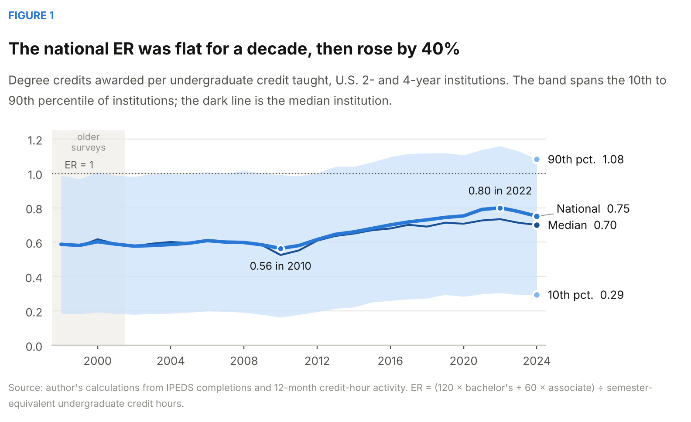

**Figure 1. The national efficiency ratio, 1998–2024.** Credit-hour-weighted aggregate of all in-sample 2- and 4-year institutions, with the median institution and the 10th–90th percentile range across degree-granting institutions. Repository table T1.

The rise was not driven by a few outliers or by credit hours shifting toward institutions that were already efficient. The whole distribution moved. Between 2010 and 2022 the median institution went from 0.53 to 0.73, the 10th percentile from 0.16 to 0.30, and the 90th percentile from 0.99 to 1.16. Within four-year institutions alone the median went from 0.72 to 0.89, and within two-year institutions from 0.24 to 0.42. Typical institutions changed.

### 4.2 A public-sector story

Figure 2 breaks the aggregate down by control and level, and Table 2 gives the levels at four benchmark years. The rise belongs to public institutions. Public four-year universities, flat at 0.68 through 2010, reached 0.90 by 2022, a rise of 32%. Public two-year colleges doubled, from 0.23 to 0.45. Private nonprofit four-year colleges, which started near 0.83, gained 9%. For-profit four-year institutions rose 66% on a rapidly shrinking base; the rise holds among the 152 institutions present in both years, from 0.48 to 0.83. The five largest online universities, which span the nonprofit and for-profit sectors, rose from 0.59 to 0.96. Every sector fell after 2022.

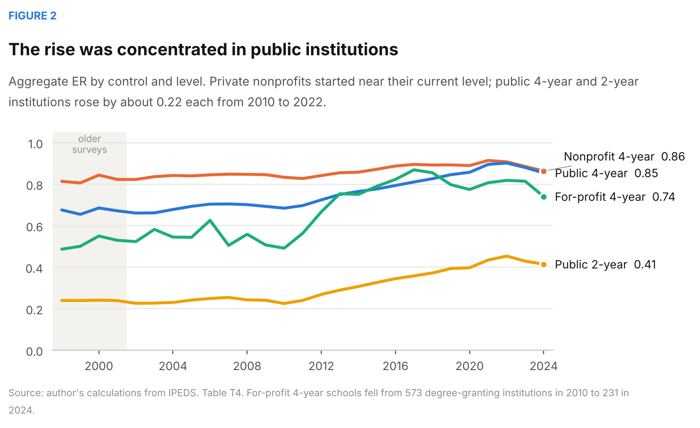

**Figure 2. Efficiency ratio by control and level, 1998–2024.** Aggregate ER within each sector. Repository table T4.

::: {.panel-tabset}

#### By sector

[]{#table-2-sector}

**Table 2. Efficiency ratio by sector, selected years**

|  | 1998 | 2010 | 2022 | 2024\* | Rise, 2010–22 |
| --- | --- | --- | --- | --- | --- |
| All 2- and 4-year institutions | 0.59 | 0.56 | 0.80 | 0.75 | +42% |
| Public 4-year | 0.68 | 0.68 | 0.90 | 0.85 | +32% |
| Public 2-year | 0.24 | 0.23 | 0.45 | 0.41 | +102% |
| Private nonprofit 4-year | 0.81 | 0.83 | 0.91 | 0.86 | +9% |
| Private for-profit 4-year | 0.49 | 0.49 | 0.82 | 0.74 | +66% |
| Memo: five largest online universities | — | 0.59 | 0.96 | 0.89 | +63% |

*\* 2024 IPEDS data are provisional. Memo row: Western Governors, Southern New Hampshire, University of Phoenix (all campuses), Liberty and Grand Canyon; they also appear in their sector rows. 1998 omitted because Western Governors did not yet operate and Liberty fails the reporting screens that year. Source: author's calculations from IPEDS. Repository table T25.*

#### By sector and research intensity

[]{#table-2-research}

**Table 2b. Efficiency ratio by sector and research intensity, selected years**

|  | 1998 | 2010 | 2022 | 2024\* | Rise, 2010–22 |
| --- | --- | --- | --- | --- | --- |
| **All 2- and 4-year institutions** | **0.59** | **0.56** | **0.80** | **0.75** | **+42%** |
| **Public 4-year** | **0.68** | **0.68** | **0.90** | **0.85** | **+32%** |
| R1 (very high research) | 0.83 | 0.88 | 0.99 | 0.96 | +13% |
| R2 (high research) | 0.76 | 0.81 | 0.99 | 0.94 | +23% |
| Doctoral/professional | 0.74 | 0.78 | 0.94 | 0.92 | +20% |
| Master's | 0.74 | 0.77 | 1.01 | 0.95 | +32% |
| Baccalaureate | 0.48 | 0.48 | 0.76 | 0.70 | +60% |
| Associate (bachelor's-granting community colleges) | 0.22 | 0.22 | 0.47 | 0.44 | +116% |
| Special focus / other | 1.03 | 1.16 | 1.25 | 1.21 | +8% |
| **Public 2-year** | **0.24** | **0.23** | **0.45** | **0.41** | **+102%** |
| **Private nonprofit 4-year** | **0.81** | **0.83** | **0.91** | **0.86** | **+9%** |
| R1 (very high research) | 0.89 | 0.90 | 0.91 | 0.92 | +1% |
| R2 (high research) | 0.85 | 0.85 | 0.92 | 0.88 | +8% |
| Doctoral/professional | 0.85 | 0.87 | 0.95 | 0.88 | +9% |
| Master's | 0.82 | 0.85 | 0.94 | 0.88 | +11% |
| Baccalaureate | 0.75 | 0.76 | 0.83 | 0.79 | +9% |
| Associate | 0.47 | 0.34 | 0.50 | 0.47 | +47% |
| Special focus / other | 0.76 | 0.77 | 0.85 | 0.88 | +10% |
| **Private for-profit 4-year** | **0.49** | **0.49** | **0.82** | **0.74** | **+66%** |
| Doctoral/professional | 0.67 | 0.45 | 1.00 | 0.79 | +123% |
| Master's | 0.48 | 0.62 | 0.74 | 0.73 | +19% |
| Baccalaureate | 0.45 | 0.42 | 0.75 | 0.80 | +77% |
| Associate | 0.45 | 0.29 | 0.44 | 0.43 | +52% |
| Special focus / other | 0.53 | 0.56 | 0.78 | 0.77 | +40% |
| Memo: five largest online universities | — | 0.59 | 0.96 | 0.89 | +63% |

*Research intensity = Carnegie 2021 basic classification, held fixed over time; institutions that closed before 2021 are unclassified and appear only in the sector total. Rows with fewer than five institutions in 2022 are omitted. Repository table T25b.*

:::

The contrast is sharpest among research universities (Figure 3). Every public class rose, and the gaps among public research, doctoral and master's universities closed: by 2022 all sat near 1.0. Public R1 universities rose from 0.88 in 2010 to 0.99 in 2022. Public baccalaureate colleges and the community colleges that now award a few bachelor's degrees rose most, by 60% and 116%. Private nonprofit R1 universities, by contrast, sat at about 0.90 for the entire period, and no private nonprofit class other than the small Associate group rose by more than 11%. One plausible difference is how many students arrive through state transfer pipelines and with state-guaranteed credit. I do not measure transfer intake by Carnegie class, so the contrast is suggestive rather than conclusive, but it is the first of several patterns that fit imported credit better than internal efficiency.

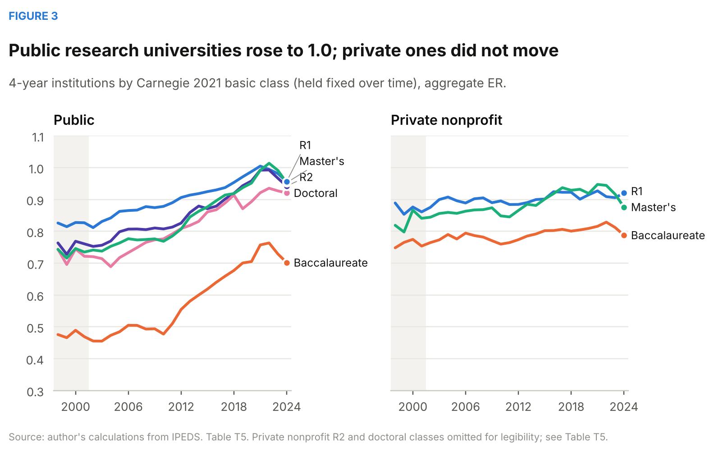

**Figure 3. Efficiency ratio by research intensity, public and private nonprofit 4-year institutions.** Carnegie 2021 basic classes, held fixed over time; private nonprofit R2 and doctoral classes omitted for legibility. Repository table T5.

### 4.3 Every state

The rise was national. Figure 4 plots each state's public system, its public two- and four-year institutions pooled, in 2010 and 2022. Every one of the 51 public systems rose. The largest gains came in states with big community-college systems and active transfer policy: California rose 0.36, Arkansas 0.34, Oregon, New Mexico and Maryland 0.33. The smallest came in small northeastern and mountain systems, New Hampshire and Vermont (0.11), Maine (0.13) and Montana (0.14). By 2024 the public four-year systems of Maryland, Kansas and Connecticut were at or near 1.

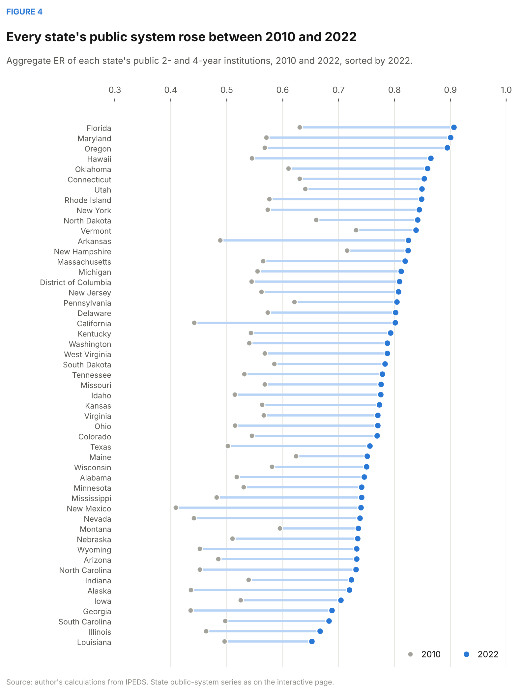

**Figure 4. Efficiency ratio of each state's public system, 2010 and 2022.** Public 2- and 4-year institutions pooled within each state. Repository table T18a. Interactive version: the state map, with a year slider.

### 4.4 Institutions that award more than they teach

An institution whose ratio exceeds 1 certifies more degree credit than it teaches, which over any sustained period most plausibly reflects imported credit. Figure 5 tracks how common that has become among four-year institutions. In 2010, 9% of public four-year institutions had a ratio above 1, against 19% of private nonprofits. By 2022 the public share had more than tripled, to 30%, matching the private nonprofit share. Across all institutions, the number above 1 went from 377 in 2010 to 736 in 2022, before falling to 546 in 2024. Most of those that crossed 1 did not go far past it: the public share above 1.2 only doubled, from 4% to 9%. The movement is a broad shift of the distribution, not a few institutions running off the scale.

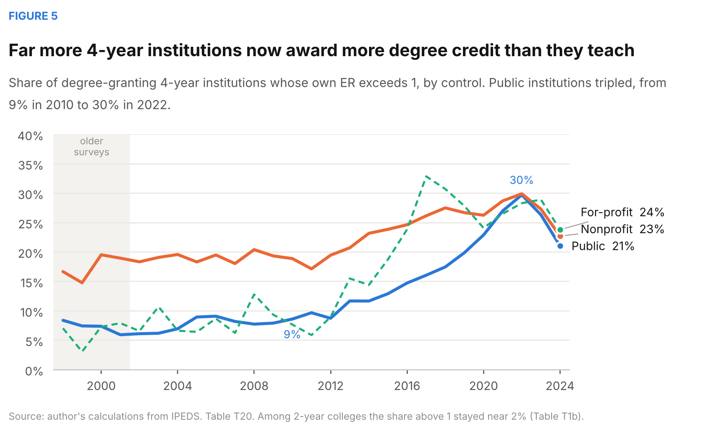

**Figure 5. Share of 4-year institutions with ER above 1, by control.** Repository table T20. Interactive version: threshold slider from 0.50 to 1.20.

Community colleges are measured against the same benchmark, since an associate degree counts at its own 60 credits, and they fall far short of it. In 2022 public two-year colleges taught 132 credits for every degree they awarded, more than twice the 60 an associate degree requires, and their ratio was 0.45. Only 20 of 1,096 two-year colleges, 2%, had a ratio above 1. That is down from 267 credits per degree in 2010, but most community-college teaching still does not end in that college's credential. It goes to students who transfer before finishing, to certificates, to high-school students in dual enrollment and to students who leave. Section 6.4 returns to what that means for the four-year side of the ledger.

### 4.5 How much is cohort timing?

The first worry about any ratio of a flow to a stock is timing. Credits go to every enrolled class, but degrees go to classes that entered years earlier. The years around 2010 are exactly the pattern that would mislead: a recession surge in entering classes followed by a decade of shrinking ones. Public four-year entering-class growth peaked at 1.15 in 2010 and fell to 0.95 by 2022; at private nonprofits the swing was smaller, from 1.03 to 0.97 (Figure 6, left). At community colleges it was far larger. First-time entrants at public two-year colleges rose from 790,000 to 1.0 million between the classes entering in fall 2007 and fall 2009, so growth reached 1.30 in 2011 and fell to 0.81 by 2022. That spike is real, not a reporting artifact.

I estimate the size of the timing effect from institutions, not from state or national aggregates, which load anything else that moved with the national cohort cycle onto growth. Table 3 regresses each four-year institution's log ER on the log of its own entering-class growth, 1998–2024, separately for public and private nonprofit institutions, with year fixed effects throughout and with and without fixed effects for the institution's Carnegie research class. For-profit institutions are left out: their enrollment swung enormously and for reasons unrelated to the timing of degrees, and in pooled regressions they dominate the estimate (Appendix Table B4).

::: {.panel-tabset}

#### Public vs. nonprofit (used in the paper)

[]{#table-3-paper}

**Table 3. The elasticity of the ER with respect to entering-class growth, 4-year institutions, 1998–2024**

|  | (1) Public | (2) Public | (3) Nonprofit | (4) Nonprofit |
| --- | --- | --- | --- | --- |
| ln growth → ln ER (elasticity) | 0.040 (0.026) | **−0.076\*\*\*** (0.018) | −0.085\*\*\* (0.014) | **−0.128\*\*\*** (0.013) |
| ln growth → ER (ER points per log point) | 0.026\*\* (0.012) | −0.036\*\*\* (0.009) | −0.081\*\*\* (0.009) | −0.106\*\*\* (0.009) |
| Year fixed effects | Yes | Yes | Yes | Yes |
| Carnegie class fixed effects | No | Yes | No | Yes |
| R², full model | 0.077 | 0.667 | 0.019 | 0.162 |
| R², fixed effects alone | 0.077 | 0.666 | 0.012 | 0.147 |
| R², within (growth alone) | 0.0005 | 0.005 | 0.007 | 0.018 |
| Mean ER | 0.667 | 0.667 | 0.830 | 0.830 |
| Institution-years | 21,068 | 21,068 | 31,295 | 31,295 |
| Institutions | 858 | 858 | 1,515 | 1,515 |

*Dependent variable: ln ER in the first row and ER in the second; R² rows refer to the first. Growth = (Eₜ + Eₜ₋₁) ÷ (Eₜ₋₄ + Eₜ₋₅), first-time degree-seeking entrants (denominator at least 20). Carnegie class = 2021 basic classification in eight groups, fixed over time. Unweighted; standard errors clustered by institution. \* p < 0.10, \*\* p < 0.05, \*\*\* p < 0.01. Columns 2 and 4 are used throughout the paper. Repository table T23b (script 19).*

#### All specifications

[]{#table-3-all}

**Table 3, all specifications (Appendix Table B4). The growth elasticity across specifications, 4-year institutions, 1998–2024**

ln ER on ln entering-class growth. (A) no fixed effects; (B) year; (C) year + state; (D) state × year. Columns 1–4 all 4-year institutions (60,164 institution-years; 3,052 institutions), 5–8 adding sector (control) fixed effects, 9–12 public only (21,068; 858).

|  | 1 (A) | 2 (B) | 3 (C) | 4 (D) | 5 (A) | 6 (B) | 7 (C) | 8 (D) | 9 (A) | 10 (B) | 11 (C) | 12 (D) |
| --- | --- | --- | --- | --- | --- | --- | --- | --- | --- | --- | --- | --- |
| Elasticity | −0.106\*\*\* | −0.081\*\*\* | −0.086\*\*\* | −0.086\*\*\* | −0.125\*\*\* | −0.099\*\*\* | −0.104\*\*\* | −0.104\*\*\* | −0.041 | 0.040 | 0.034 | 0.079\*\*\* |
| (s.e.) | (0.009) | (0.009) | (0.009) | (0.009) | (0.009) | (0.009) | (0.009) | (0.009) | (0.028) | (0.026) | (0.022) | (0.027) |
| R², full | 0.009 | 0.037 | 0.128 | 0.140 | 0.100 | 0.127 | 0.185 | 0.197 | 0.001 | 0.077 | 0.301 | 0.327 |
| R², FE only | — | 0.033 | 0.122 | 0.135 | 0.088 | 0.120 | 0.177 | 0.190 | — | 0.077 | 0.301 | 0.326 |
| R², within | — | 0.005 | 0.006 | 0.006 | 0.013 | 0.008 | 0.010 | 0.009 | — | 0.001 | 0.001 | 0.002 |

*Unweighted; standard errors clustered by institution. The all-4-year estimates are driven largely by private for-profit institutions, whose own elasticity is about −0.16; private nonprofits alone give −0.085 to −0.099. Adding control × Carnegie fixed effects to columns 5–8 gives −0.135 to −0.161. Repository table T23 (script 19), which also reports the same models in ER points and credit-hour-weighted and trimmed variants. The paper uses Table 3, which drops for-profits and adds Carnegie class.*

:::


The Carnegie controls matter, and for a telling reason. Across public Carnegie classes, growth and the ratio move together: R1 universities have the highest ratios (0.89) and grew fastest, while the community colleges classified as four-year have the lowest (0.31) and barely grew. Within a class, faster growth goes with a lower ratio, as timing predicts. Without the controls the public coefficient is slightly positive; with them it is −0.076. At nonprofits the controls move the estimate from −0.085 to −0.128. I use columns 2 and 4: a 10% larger pair of entering classes lowers a public university's ratio by about 0.7% and a nonprofit's by about 1.2%.

Those are small effects, smaller than the timing arithmetic alone would suggest. If every class grew at the same rate and nothing else differed, degrees would lag credits by about three years and the elasticity would be about −0.75. Institution-level growth is noisy, which pulls estimates toward zero, but the gap is large. Figure 6 shows both.

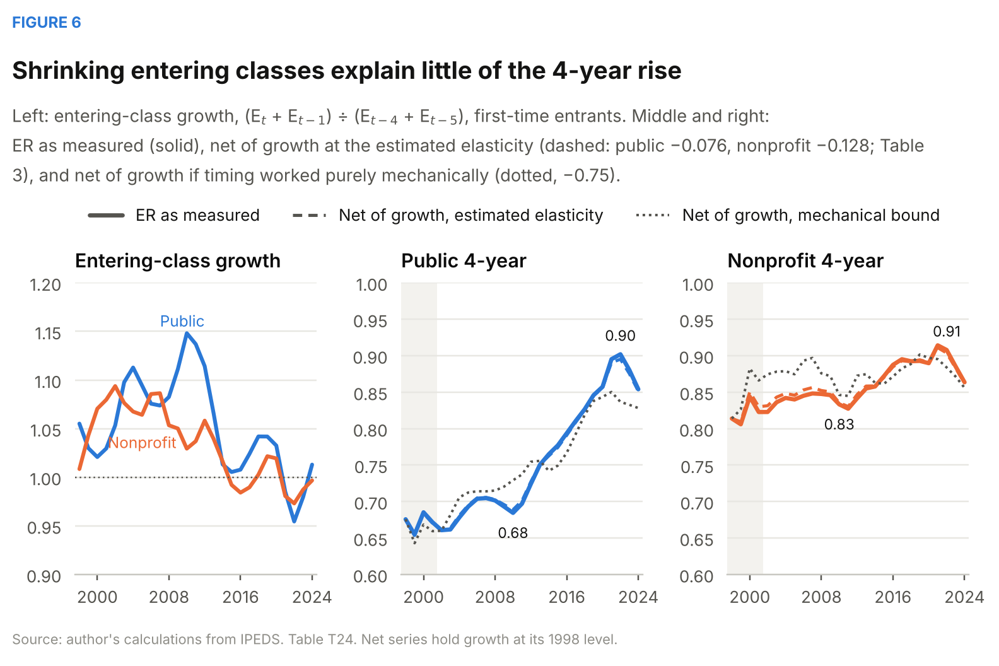

**Figure 6. Entering-class growth and the ER net of growth, public and private nonprofit 4-year institutions.** Net series hold growth at its 1998 level, using the elasticities of Table 3 (dashed) and the mechanical value of −0.75 (dotted). Repository table T24.

At the estimated elasticities, cohort timing explains 5% of the public four-year rise between 2010 and 2022 (0.011 of 0.218 ER points) and 8% of the nonprofit rise (0.006 of 0.075). For the two sectors combined it explains 6% of the rise and 8% of the decline after 2022. Net of growth, the public ratio still climbs from 0.69 to 0.90. Even the mechanical bound, which no regression supports, explains only about half of the 2010–2022 rise in either sector, and its net public series still rises from 0.73 to 0.84. I do not estimate an elasticity for two-year colleges; their much larger swing in entering classes means timing could matter more there (Section 6.4). First-year retention, the other mechanical candidate, explains almost nothing: about 0.01 ER points or less.

The conclusion of this section is that the rise is large, recent, broad across institutions and states, and concentrated in the public sector, and that cohort timing explains only a small part of it.

## 5. What a higher ratio means for the cost of a degree

### 5.1 Price per credit and price per degree

A rising efficiency ratio changes the arithmetic of college prices. If students pay a price p per credit and an institution awards degrees at ratio ER, the tuition it collects per bachelor's-equivalent degree is

```latex
\text{tuition per degree} = \frac{p \times 120}{ER}
```

so the index of tuition per degree is the price index divided by the ER index. When the ratio rises, each degree brings the institution less tuition than the per-credit price suggests. I measure price three ways, all in real 2024 dollars: published tuition and fees (in-district for community colleges, in-state for other public institutions); undergraduate net tuition revenue after discounts and allowances, from institutional finance reports beginning in 2003; and the net cost of attendance, the federal net price for first-time full-time aid recipients beginning in 2009. Net cost of attendance covers tuition, fees, housing, food, books and transportation, net of grants. It belongs in a per-credit calculation for a simple reason: in any year a student pays for the credits they take, but also for everything else that comes with the year in which they take them. A credit stands for its share of that whole bundle. Using it per degree assumes that institutions aid transfer students much as they aid first-time, full-time students. Every aggregate is a credit-hour-weighted average of institutions' own prices, divided by the same institutions' aggregate ratio.

### 5.2 Nation and sectors

The rising ratio absorbed most of the increase in prices (Figure 7, Table 4). Real published tuition per credit rose 55% between 2002 and 2024. Tuition per degree rose 18%; net tuition revenue per degree did not rise at all, and the net cost of attendance per degree fell 8%. Had the national ratio stayed at its 2010 level, tuition per degree in 2024 would have been about a third higher. The timing follows the ratio: while the ratio was flat, per-credit and per-degree prices moved together, so tuition per degree peaked in 2010 and has fallen since.

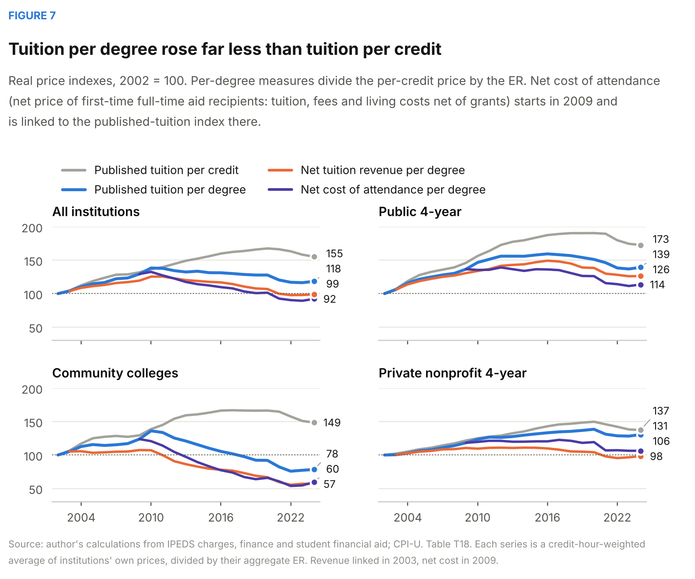

**Figure 7. Real prices per credit and per degree, nation and sectors, 2002–2024.** Index, 2002 = 100. Repository table T18. Interactive version: the tuition section, with measure and view selectors.

**Table 4. Real price indexes in 2024 (2002 = 100)**

|  | Published tuition per credit | ER | Published tuition per degree | Net tuition revenue per degree | Net cost of attendance per degree |
| --- | --- | --- | --- | --- | --- |
| All 2- and 4-year | 155 | 131 | 118 | 99 | 92 |
| Public 4-year | 173 | 124 | 139 | 126 | 114 |
| Community colleges | 149 | 190 | 78 | 57 | 60 |
| Private nonprofit 4-year | 137 | 105 | 131 | 98 | 106 |
| Private for-profit 4-year | 90 | 147 | 62 | 56 | 59 |

*Net tuition revenue is linked to the published-tuition index in 2003 and net cost of attendance in 2009, so they measure growth from those years on a 2002 base. Source: author's calculations from IPEDS charges, finance and student aid files; CPI-U. Repository table T18.*

The sectors tell different stories. At public four-year universities, real tuition rose 73% while tuition per degree rose 39%; in dollars, tuition per bachelor's-equivalent went from about $33,500 to $46,600, and net tuition revenue per degree lands at the same figure, a useful check that the published-price measure is not far off. The net cost of attendance per degree rose only 14%. At community colleges, in-district tuition rose 49%, but because the ratio nearly doubled, tuition per degree fell 22%, and on net revenue and net cost it fell 40% or more. At private nonprofits the published-price and revenue measures diverge: tuition per degree rose 31% on sticker prices but was flat on net revenue, a reminder that rising discounts make sticker prices misleading in that sector.

### 5.3 States

The state view pools each state's public two- and four-year institutions, each at its own price (Figure 8). Within that pool, a credit taught at a community college and later counted toward a bachelor's at the state university stays inside the system, so this measure comes closer to what a public system collects per degree it produces. In the median state, real published tuition per credit rose 72% while tuition per degree rose 25%. The ratio did the most work in California, where real public tuition per credit rose 160% but tuition per degree only 54%; large gains in the ratio also offset large tuition increases in Nevada, Oregon, Texas and Georgia. Only Maryland, Florida and New Mexico collect less published tuition per degree than in 2002. Where tuition per degree rose most, in Arizona, Virginia and Colorado, tuition increases simply outran gains in the ratio.

The other two price measures tell the same story at lower levels. On net tuition revenue, the median state's price per credit rose 51% and its price per degree 12%, and 15 of 51 systems collect less per degree than in 2002. On net cost of attendance, the median state's price per degree rose only 2%, and 23 systems are below their 2002 level, led by New Mexico (−56%), Florida and Nevada. Figures 8b and 8c show those versions; one of the three will appear in the final paper, and the others on the interactive page.

::: {.panel-tabset}

#### Published tuition

[]{#fig-8-published}

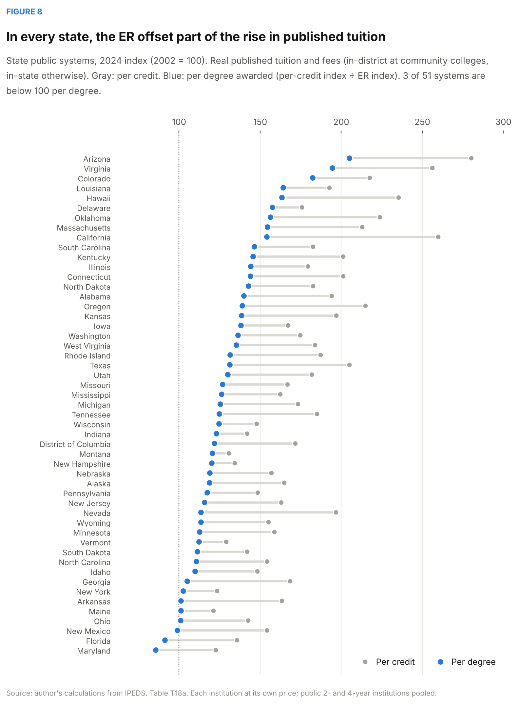

**Figure 8. Real published tuition per credit and per degree, state public systems, 2024.** Index, 2002 = 100. Repository table T18a.

#### Net tuition revenue

[]{#fig-8-revenue}

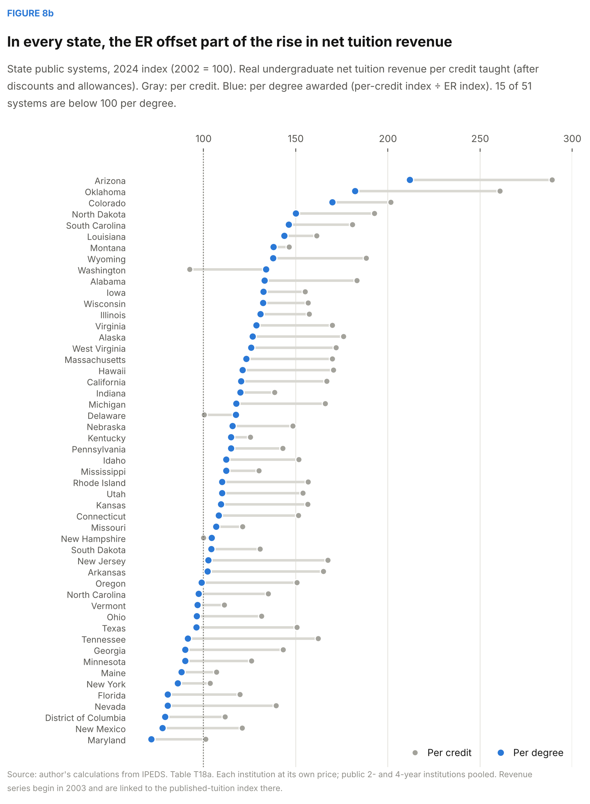

**Figure 8b. Real net tuition revenue per credit and per degree, state public systems, 2024.** Index, 2002 = 100; revenue linked to published tuition in 2003. Repository table T18a.

#### Net cost of attendance

[]{#fig-8-netcost}

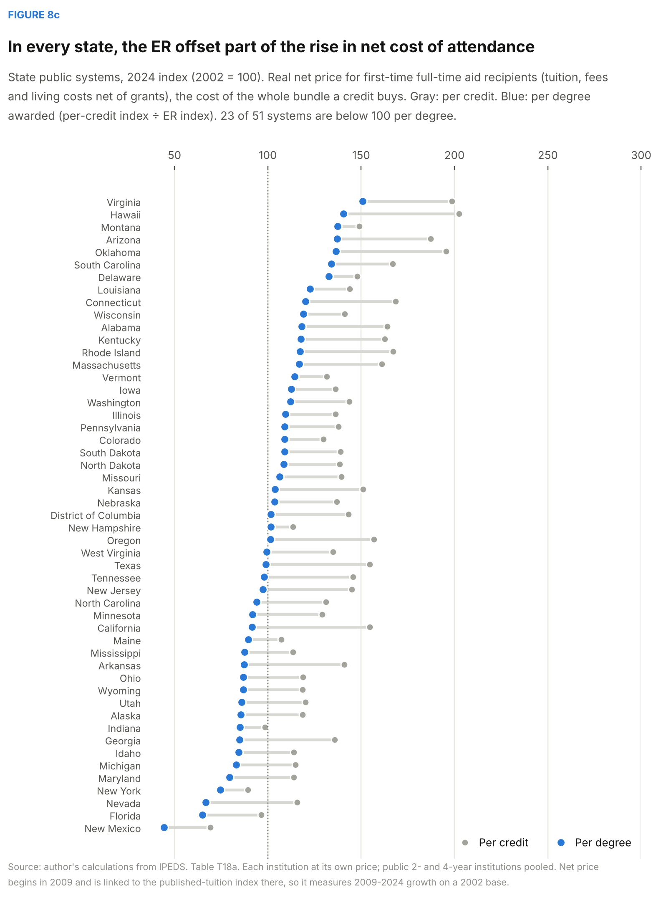

**Figure 8c. Real net cost of attendance per credit and per degree, state public systems, 2024.** Index, 2002 = 100; net price linked to published tuition in 2009. Repository table T18a.

:::


### 5.4 Saving or shifting?

The state measure already captures one kind of shifting. Each credit is priced at the institution that teaches it, so when a state moves lower-division credit from its universities to its community colleges, the system's price per degree falls in Figure 8 by exactly the price gap between them. And because net cost of attendance counts grants, Figure 8c also captures "free" community college: since 2009–10, grant aid has on average covered the full tuition of first-time full-time public two-year students ([College Board](https://research.collegeboard.org/trends/college-pricing/highlights)). In 2024–25 average published tuition and fees were $4,050 at public two-year colleges and $11,610 at public four-year institutions ([College Board, via NASFAA](https://www.nasfaa.org/news-item/34985/Sticker_v_Net_Price_in_2024-25_The_College_Board_Breaks_Down_What_Students_Actually_Pay_to_Attend_College)), and community-college students more often live at home.

What the state measure cannot say is whether the system also teaches fewer credits per degree. A lower price per degree can come from teaching the same credits at cheaper places, or from teaching fewer of them. The first is a shift of where the money is spent, with taxpayers carrying part of the cost through appropriations to community colleges and dual-enrollment programs; the second is a saving. Section 8's accounting addresses that split. Three pieces sit outside the state measure altogether: AP credit, which costs the student a $99 exam and the system nothing; dual-enrollment credit taught in high schools, which is counted at the college's published price but is often waived or discounted; and credit carried across state lines. A full accounting of public cost per degree, including state appropriations and federal aid, is beyond this paper.

## 6. The channels

Three channels bring credit into a university from outside: dual enrollment, AP and transfer from community colleges, increasingly packaged as certificates built for that purpose. Dual enrollment, AP and transfer-oriented certificates grew while the ratio rose; transfer volume did not (Section 7.5). None can yet be traced into individual degrees, but their size and timing are informative, and they frame the tests in Section 7.

### 6.1 Dual enrollment

In 2022–23 IPEDS began counting, for the first time, the high-school students who take college courses for credit during the year. The numbers are large and growing. Dual enrollment reached 2.51 million students in 2022–23 and 2.82 million in 2023–24, a 13% increase in a single year (Table 5). At public two-year colleges, dual-enrollment students are 23% of everyone enrolled during the year; at the median such college they are a quarter. About 95% of public two-year colleges enroll them, and 103 institutions are majority high-school students. In Indiana they are half of public two-year enrollment, Ivy Tech alone counting 91,000; in Iowa and North Dakota they exceed 40%. California, Texas and New York have the most in absolute terms, at 292,000, 284,000 and 176,000.

**Table 5. Dual enrollment by sector, 2023–24**

| Sector | Dual-enrolled students | Share of 12-month undergraduates | Institutions with 25%+ | Institutions with 50%+ |
| --- | --- | --- | --- | --- |
| Public 2-year | 1,413,000 | 22.7% | 409 | 57 |
| Public 4-year | 1,158,000 | 11.3% | 147 | 21 |
| Private nonprofit 4-year | 243,000 | 6.7% | 89 | 23 |
| All institutions | 2,824,000 | 12.9% | 663 | 103 |

*Source: author's calculations from IPEDS 12-Month Enrollment, high-school student counts. Repository table T8. Several large community-college districts that award a few bachelor's degrees are coded public 4-year, which raises that sector's count.*

The direct count exists for only two years, so to see the trend I use fall enrollment of undergraduates under 18, which IPEDS has collected in odd years since the 1980s. A fall snapshot misses students enrolled only in spring or summer: in 2023–24 the full-year count at public two-year colleges was 1.53 times the fall under-18 count at the same institutions, a ratio that barely moved between the two overlap years (1.57 in 2022–23) and is consistent with the Community College Research Center's finding that fall counts capture about 60% of the full-year total. Applying that ratio to earlier falls implies about 130,000 full-year dual enrollees at public two-year colleges in 1987, 580,000 in 2009, and 1.1 million in 2019, against the direct count of 1.4 million in 2023–24 (Figure 9). Most of the growth came after 2011, in step with the rise in the efficiency ratio.

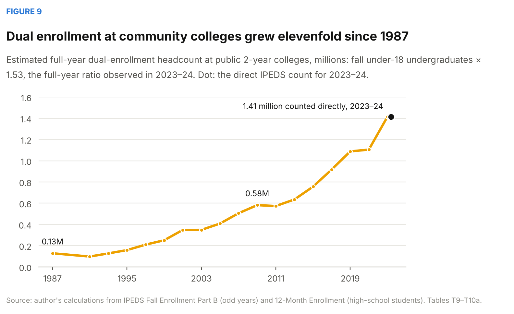

**Figure 9. Estimated full-year dual enrollment at public 2-year colleges, 1987–2023.** Fall under-18 undergraduates scaled by the 2023–24 full-year ratio. Repository tables T9–T10a.

At an assumed 6–9 credits per student per year (IPEDS does not report it), 2.8 million dual enrollees take 17–25 million credits, 4–7% of all undergraduate credits taught. Those credits sit in the teaching college's denominator, where they hold its ratio down. When a student later carries them to a university, they raise that university's degree credits without adding to its credits taught.

### 6.2 Advanced Placement

AP credit never enters IPEDS: no college teaches it, and no survey asks how much a graduate brought. The College Board's exam counts are the best measure of supply. The number of AP exams scoring 3 or higher rose from 1.16 million in 2004 to 1.86 million in 2010, 2.87 million in 2022 and 3.83 million in 2024, the last jump reflecting a change in scoring practice (Figure 10). By student, 22.6% of the public high-school class of 2024, some 786,000 graduates, scored 3 or higher on at least one exam ([College Board](https://reports.collegeboard.org/ap-program-results/class-of-2024)). More than 2,100 institutions award credit for AP scores, and 37 states require public institutions to award credit for a 3 (Table 1).

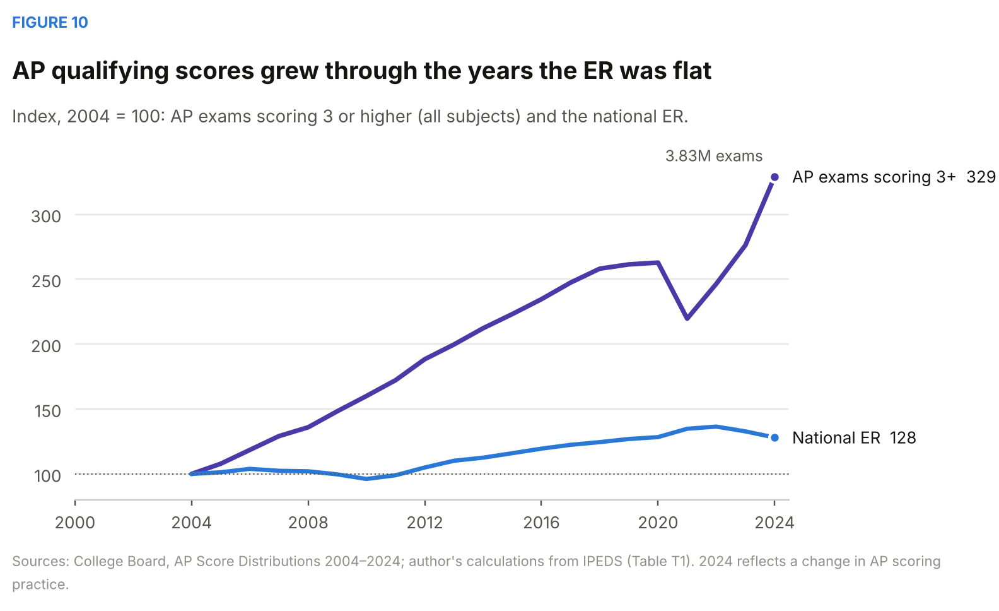

**Figure 10. AP exams scoring 3 or higher and the national ER, 2004–2024.** Index, 2004 = 100. Sources: College Board AP Score Distributions; repository table T1.

At the point of entry AP looms large. The 3.8 million qualifying exams of 2024 compare with about 1.26 million first-time freshmen at four-year institutions. If each replaced one course of a ten-course first year, AP would displace up to 30% of first-year courses at four-year institutions; the true share is lower, because many qualifying exams are taken by students who go to two-year colleges or do not enroll, and some earn no credit. Relative to all instruction, however, AP is small: at three credits per qualifying exam, it amounts to about 3% of undergraduate credits taught. And its timing does not match the ratio's. Qualifying exams grew 60% between 2004 and 2010, while the ratio did not move. AP matters a great deal to some universities, but it is not the main story nationally (Section 8).

### 6.3 Certificates built for transfer

Community-college certificates tripled between 2002 and 2025, from 258,000 to 779,000, rising from 0.59 to 0.92 certificates per associate degree. Most of the growth is short vocational awards in business, information technology, welding and mechanics. But the single largest source of growth since 2010 is something else: general-education certificates (CIP 24.01), which rose from 16,000 to 125,000 and account for 30% of all net certificate growth (Figure 11). Unlike vocational certificates, 78% of these are awards of one year or longer, and 51% are awarded in California, where they are mostly CSU GE-Breadth and IGETC certificates of achievement. They certify a completed block of lower-division general education that will be counted toward a bachelor's degree somewhere else: the same channel the efficiency ratio detects at the receiving end. Counting them as output at the community college and again inside the bachelor's degree they feed would count the same credit twice.

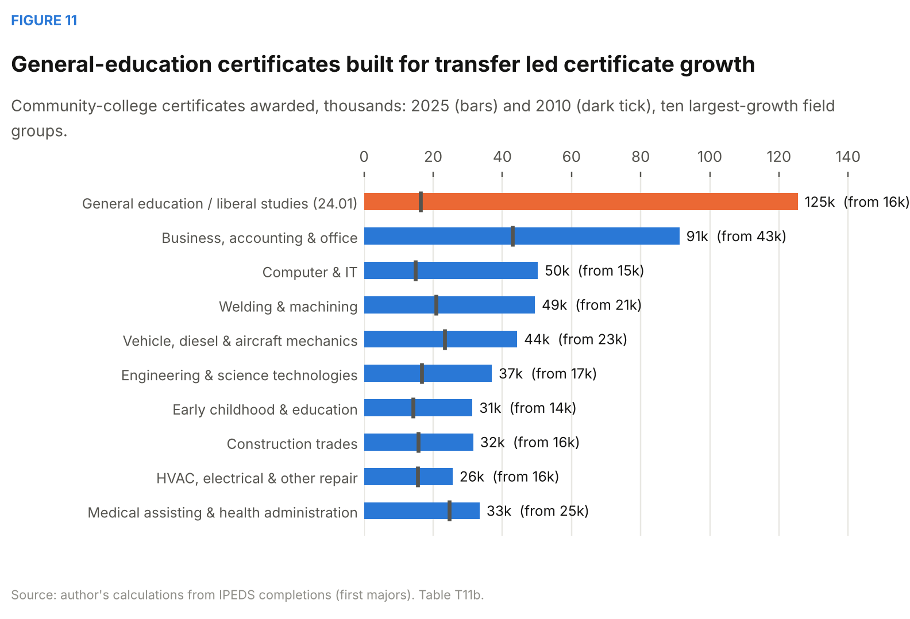

**Figure 11. Community-college certificates by field group, 2010 and 2025.** Ten field groups with the largest growth. Repository table T11b.

### 6.4 The community-college side of the ledger

Community colleges' own ratio doubled, and it doubled in an unusual way (Figure 12). From 1998 to 2010 it sat at about 0.23, with associate degrees and credits taught growing in step; the fixed group of community colleges in Figure 12 taught about 260 credits per associate degree. Between 2010 and 2022 associate degrees rose 41% while credits taught fell 29%, as fall headcount dropped by a quarter, and credits taught per degree halved, to 130. Part of this is the enrollment cycle: the recession surge in entering classes, 1.30 times the classes four and five years earlier at its 2011 peak, filled classrooms before it produced degrees, and its unwinding did the reverse. A shorter window suited to two-year programs, (Eₜ + Eₜ₋₁) ÷ (Eₜ₋₂ + Eₜ₋₃), shows the same swing, from 1.22 in 2010 to 0.82 in 2022. I do not estimate a timing elasticity for two-year colleges. Part is reform: the Associate Degree for Transfer and guided pathways aim at exactly this, more students finishing a credential before they move on. Reverse transfer adds associate degrees with no new teaching at all.

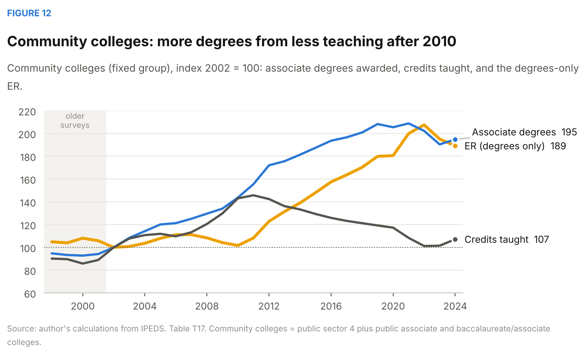

**Figure 12. Community colleges: associate degrees, credits taught and the ER, 1998–2024.** Index, 2002 = 100. Repository table T17.

Dual enrollment holds the community colleges' measured ratio down, because credits taught to high-school students rarely become a community-college degree. Removing an estimated 6–9 credits per dual enrollee raises the 2022 ratio of the community colleges in Figure 12 from 0.47 to 0.52–0.55. (That fixed group sits slightly above the public two-year sector as a whole, at 0.45 in Table 2.) And most community-college credits still do not end in that college's degree. They go to students who transfer before finishing, to certificates, to dual enrollment and to students who leave. The credits that transfer and count toward a bachelor's appear as output at the receiving university: they are the other half of the four-year outsourcing story.

## 7. Outsourcing or efficiency?

An institution's ratio can rise because it imports more credit or because it wastes less. This section sets out what each explanation predicts (Table 6), tests the measurable fundamentals directly, and asks where the fall in teaching per degree happened.

### 7.1 What each story predicts

**Table 6. Predictions of the two explanations**

| Evidence | Genuine efficiency predicts | Credit outsourcing predicts | What the data show |
| --- | --- | --- | --- |
| Credits taught per enrolled student | Flat if completers take fewer total credits; falls only if annual loads shrink | Flat: students still take full loads, but some credits are earned elsewhere | Roughly flat, 23–25 per fall undergraduate since 1998 |
| On-time vs eventual completion | Both rise | On-time rises faster, as students arrive with credits | Public: on-time +14 points, eventual +7; nonprofit +5 and +3 |
| Fewer leavers | Explains much of the rise | Explains little | 0.013–0.031 ER points in each sector: 6–14% of the public rise |
| Institutions with ER above 1 | Rare: efficiency cannot keep an institution above 1 | Common where imports are heavy | Public 4-year share tripled, to 30% |
| Where teaching per degree fell | Wherever reform took hold | Public universities fed by state pipelines, and community colleges | Public 4-year −25%, public 2-year −51%, nonprofit −8% |
| Who rises most | Institutions with the most reform | Public institutions fed by state transfer and dual-enrollment pipelines | Public R1s to 1.0; private R1s flat |
| Transfer entrants' share of degrees | No change needed | Rising, if the channel is more transfer students | Flat at about 42%: consistent with more credit per student |

### 7.2 The fundamentals, measured directly

I regress each institution's ratio on its completion rates (within four and six years for four-year institutions; within 100% and 150% of normal time for two-year), first-year retention and entering-class growth, for 2008–2024. Completion for each year comes from the graduation-rate cohort that would be graduating that year. The four-year sample has 29,538 institution-years at 2,273 institutions; the two-year sample has 17,231 at 1,662. Appendix Tables B1–B3 report the full results. Across institutions, higher six-year completion goes with a higher ratio, about 0.04 per 10 points of completion. Within institutions over time, it is faster on-time completion that matters. Retention adds little once completion is included.

Figure 13 holds all three fundamentals at their 2008 levels and recomputes the aggregate ratio. Two specifications bracket the answer: pooled regressions, which use differences across institutions, and institution fixed effects, which use changes within them.

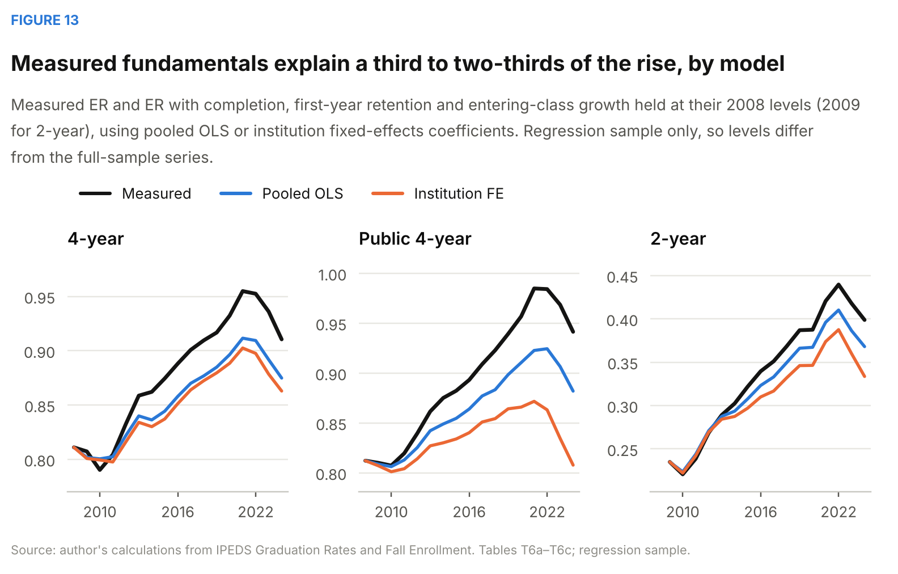

**Figure 13. Measured ER and ER with completion, retention and growth held at 2008 levels.** Regression sample only, so levels differ slightly from Figure 1. Repository tables T6b and T6c.

**Table 7. Share of the ER change explained by completion, retention and growth**

| Sample and period | Change in measured ER | Pooled OLS | Institution FE | Without completion (pooled / FE) |
| --- | --- | --- | --- | --- |
| 4-year, 2008–2022 | +0.141 | 30% | 39% | 16% / 15% |
| 4-year, 2022–2024 | −0.042 | 18% | 18% | 4% / 21% |
| Public 4-year, 2008–2022 | +0.172 | 35% | 70% | 11% / 10% |
| 2-year, 2009–2022 | +0.205 | 14% | 25% | 10% / 12% |

*Source: author's calculations from IPEDS Graduation Rates, Fall Enrollment and completions. Repository tables T6c and T14a.*

The fundamentals explain a third or so of the four-year rise, and up to 70% of the public four-year rise in the fixed-effects version. That larger number deserves two cautions. First, it is an upper bound: without year effects, a steadily trending variable like on-time completion absorbs any trending cause, and once year effects are added its within-institution coefficient collapses (from 0.54 to −0.10 at public four-year institutions). Second, and more fundamentally, completion is itself a channel for imported credit. A student who arrives with 30 dual-enrollment or AP credits finishes in four years. "Explained by completion" therefore does not mean "not outsourcing." These regressions estimate their own growth coefficients alongside completion; the timing adjustments elsewhere in the paper use the elasticities of Table 3.

### 7.3 Finishing faster, not more often

Figure 14 shows why completion needs care as an explanation, and where it changed. At public four-year institutions the share of first-time, full-time entrants who finish a bachelor's within four years rose from 31% to 45% between 2010 and 2022, while the share finishing within six years rose much less, from 56% to 63%. At private nonprofits both moved little: from 51% to 56% on time and from 64% to 67% eventually. A gain that keeps more students from leaving, such as better advising for those at risk, should raise both rates. Three things mainly raise the first: imported credit, since students who arrive with a semester or a year already completed finish sooner but not necessarily more often; fewer excess credits among students who would have finished anyway; and heavier annual loads, the aim of "15 to Finish." Section 7.4 shows that credits taught per fall student did not rise, which argues against the third. That is the pattern in the data, it accelerated after 2016, and it is far stronger at public universities.

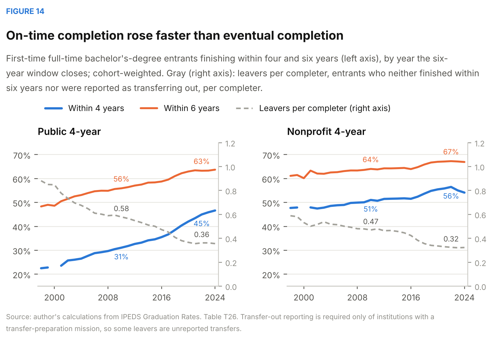

**Figure 14. Four-year and six-year bachelor's completion and leavers per completer, public and private nonprofit 4-year institutions.** Cohort-weighted rates for first-time full-time entrants, by year the six-year window closes. Repository table T26.

The right-hand scale in Figure 14 tracks leavers: entrants who neither finished within six years nor were reported as transferring out, per completer. It fell at both: from 0.58 to 0.36 at public institutions and from 0.47 to 0.32 at nonprofits. Fewer leavers means fewer credits taught to students who never earn a degree there. At 15–35 credits per leaver, the fall raises the 2022 ratio by 0.013–0.031 in both sectors, which is 6–14% of the public rise and 17–41% of the nonprofit rise. The effect is about the same size in each sector, so it explains none of the gap between them: the public rise exceeded the nonprofit rise by 0.143 ER points. These rates cover first-time full-time students only, and transfer-out reporting is incomplete, so some leavers are unreported transfers. Section 8 uses the Clearinghouse's national leaver series, which follows students across institutions.

### 7.4 Teaching per student versus teaching per degree

A second test compares teaching per enrolled student with teaching per degree. Nationally, credits taught per fall undergraduate were 24.3 in 1998 and 23.7 in 2024, moving only with the business cycle, when students take heavier loads in recessions. Credits taught per degree were flat at about 175 through 2010, then fell 29% to 125 in 2022, before edging back to 133 in 2024. All of the ratio's movement is on the degree side.

Figure 15 shows where. Teaching per student stayed within a few percent of its 1998 level at public and nonprofit four-year institutions and drifted down 7–11% at public two-year colleges. Teaching per degree did not. At public two-year colleges it halved between 2010 and 2022, from 267 to 132 credits per degree. At public four-year institutions it fell by a quarter, from 160 to 120. At private nonprofits it fell 8%, from 139 to 128. Of the 52-credit national decline, public two-year colleges account for 24 credits and public four-year institutions for 21; the shift of degrees between sectors accounts for none. The large decline in teaching per degree is a public-sector phenomenon, at both levels.

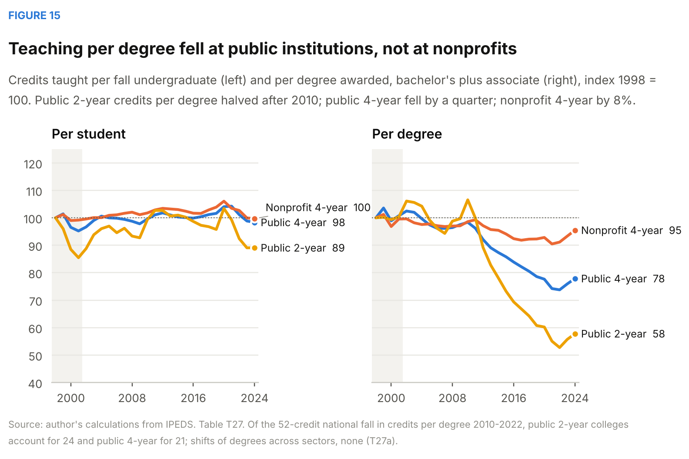

**Figure 15. Credits taught per student and per degree, by sector.** Index, 1998 = 100. Repository tables T27 and T27a.

Flat teaching per student is what outsourcing predicts: students still carry full loads, but part of their degree credit comes from elsewhere. It is also consistent with less waste, if graduates finish with fewer total credits rather than lighter loads each year. What it rules out is efficiency in the form of lighter annual loads. That the decline is concentrated at public universities and the community colleges that feed them, while nonprofit universities barely moved, fits the transfer and dual-enrollment pipelines better than a nationwide change in how students take courses.

### 7.5 Who earns the degrees

If outsourcing grew through more transfer students, the share of bachelor's degrees going to transfer entrants should have risen. It did not. The federal Outcome Measures survey follows every entering student for eight years, separately for first-time students and for those who transferred in. At public four-year institutions, 42–44% of bachelor's degrees earned within eight years go to students who transferred in, and that share is flat across all eight entering cohorts the survey covers with degree-level detail, from 2009–10 to 2016–17 (repository table T12a). A longer series is not available: each annual release reports a single entering cohort, at four, six and eight years after entry, so a six-year window would add no cohorts, and the two earlier releases (cohorts entering in 2007 and 2008) do not separate bachelor's degrees from other awards.

That share may look larger than the transfer figures the National Student Clearinghouse publishes. About 1.2 million students transferred in fall 2024, roughly 13% of non-freshman undergraduates, and only 9.4% of students who first entered college in 2019 had graduated from a different institution within six years. But those are flows measured per enrolled student or per entering cohort, not shares of degrees. Per entrant, the two sources agree. In fall 2024 about 471,000 students transferred into public four-year institutions, against 875,000 first-time freshmen: transfers are about 35% of new entrants, the same order as the 42% of degrees. The Clearinghouse data also confirm that transfer volume is not what grew. Transfers from two-year colleges into public four-year institutions fell 7% between fall 2020 and fall 2024, and the share of entering students who graduated from a different institution fell from 11.4% for the 2008 cohort to 9.4% for the 2019 cohort.

If outsourcing grew, then, it grew through more credit per graduate: transfer students arriving with more credits, and first-time students arriving with AP and dual-enrollment credit. Outcome Measures counts a student with 30 dual-enrollment credits as a first-time student.

### 7.6 Does outsourcing change what a degree means?

Hollis Robbins ([2025](https://hollisrobbinsanecdotal.substack.com/p/ai-aced-your-states-gen-ed-now-what), [2026](https://hollisrobbinsanecdotal.substack.com/p/why-sameness-not-teaching-is-the)) has argued that a university's value rests on the rigor of its courses and the capabilities of its graduates, and that when it accepts credit from elsewhere, voluntarily or by legislative mandate, it hands control of that quality to another institution. There is an irony here. Legislators demand more accountability from universities for on-time graduation and for graduates who are ready to work, while transfer mandates limit the universities' control over the foundational courses on which the rest of the curriculum builds.

At my own university, students increasingly arrive with a quarter to half of their degree credits complete, including those foundational courses. That is an observation, not a measurement, but it is the pattern the institutional data point to. If those credits prepared them poorly, the upper division is badly placed to remediate in the few semesters that remain, and the rush to finish can crowd out experiences that build professional skills. Employers rarely inspect where a graduate's credits were earned. The signal attaches to the institution whose name is on the diploma, even when that diploma rests on 60 credits of AP and community-college work and 60 credits of finishing work packed into four semesters.

Whether imported credit is actually weaker is an open question. Studies going back to Hills (1965) find "transfer shock," a drop in grades in transfer students' first term or year after transfer, which a review by Diaz (1992) put at typically half a grade point or less, with most students recovering. But they are mostly single-institution comparisons of means that do nothing about selection. The test one would want has not been run: randomly assign entering students to take Calculus I at the university or at a community college, then compare their performance in Calculus II. Short of that, universities could use their own transcripts to compare students who imported foundational courses with those who took them on campus. Nor is it obvious that the university's own version is better. Large introductory courses at research universities are often taught by graduate assistants or heavily loaded lecturers in large halls; an experienced community-college instructor may teach the same course as well or better, even if expectations differ.

## 8. Accounting for the rise

This section puts ballpark sizes on the channels that can raise the ratio, using what the earlier sections measured. It is weaker evidence than Sections 6 and 7: each row rests on an assumption, and the residual collects everything the rows miss. I do the accounting two ways (Figure 16, Table 8). The system view pools all two- and four-year institutions, nationally and then state by state; there, credit that moves between colleges nets out (Section 3.4), so the residual is mostly fewer excess credits. The four-year view covers public and private nonprofit universities only; there, credit imported from community colleges and dual enrollment does not net out and sits in the residual alongside fewer excess credits.

The two views answer different questions: the system view asks what the nation gained, the four-year view how much of the universities' gain the measured channels explain. Their difference is informative but is not a clean measure of outsourcing (Section 8.2).

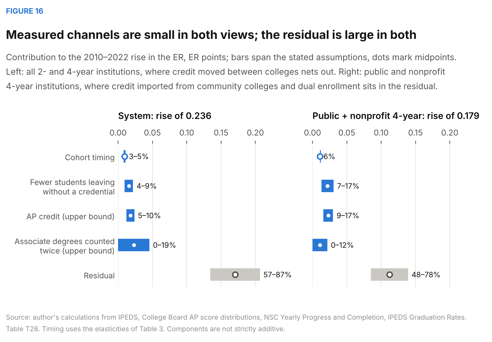

**Figure 16. Contributions to the 2010–2022 rise in the ER, two views.** Ranges under stated assumptions. Repository table T28.

**Table 8. Accounting for the 2010–2022 rise, two views (ER points; share of the rise)**

| Channel | How it is bounded | System: all 2- and 4-year (rise 0.236) | Public + nonprofit 4-year (rise 0.179) |
| --- | --- | --- | --- |
| Cohort timing | Elasticities of Table 3 applied to each sector's entering-class growth; system view adds public 2-year colleges at −0.076 for the upper value | 0.008–0.011 (3–5%) | 0.011 (6%) |
| Fewer students leaving without a credential | 15–35 credits per leaver. System: Clearinghouse leavers per completer, 0.59 to 0.49. 4-year: IPEDS first-time full-time leavers per completer (Section 7.3) | 0.010–0.022 (4–9%) | 0.013–0.031 (7–17%) |
| AP credit (upper bound) | Qualifying exams over the prior four years × 3–6 credits, all assumed to replace college teaching | 0.012–0.024 (5–10%) | 0.016–0.030 (9–17%) |
| Associate degrees counted twice (upper bound) | Rise in the full ER minus the rise in a bachelor's-only ER | 0–0.046 (0–19%) | 0–0.022 (0–12%) |
| Residual | System: fewer excess credits by completers, other untaught credit, measurement. 4-year: the same at universities, plus credit imported from community colleges and dual enrollment | 0.134–0.207 (57–87%) | 0.085–0.139 (48–78%) |

*Source: author's calculations from IPEDS; College Board AP score distributions; National Student Clearinghouse, Yearly Progress and Completion. Repository table T28 (script 25). Components are not strictly additive. The AP row in the 4-year view assigns every qualifying exam to these institutions.*

### 8.1 The system view

Cohort timing, at the elasticities estimated in Section 4.5, accounts for 3–5% of the national rise. The attrition row uses Clearinghouse cohort outcomes: six-year completion rose six points between the 2008–10 and 2016–19 cohorts, but most of that came from fewer students still enrolled at year six, which is timing rather than avoided waste. The share who left without a credential fell only from 32.5% to 30.1%. At 15–35 credits per leaver, an assumption I cannot check, that removes 4–9% of the rise. The AP row treats every exam scoring 3 or higher as credit that replaces college teaching, which overstates its effect, and still finds at most a tenth of the rise. The associate-degree row recomputes the ratio counting only bachelor's degrees; it still rose from 0.45 to 0.64, so associate degrees, including those later followed by a bachelor's, can account for at most a fifth. Dual-enrollment credit has no row of its own: if colleges report it, it is taught inside the system and nets out like transfer credit (Section 8.3 tests that).

That leaves a residual of about 0.17 ER points at the midpoints, roughly 70% of the rise. The leading candidate is that students who finish now take fewer excess credits: fewer failed, repeated, withdrawn and abandoned courses. The halving of teaching per degree at community colleges (Section 7.4) points the same way. Some of that is plausibly genuine efficiency, the target of guided pathways, "15 to Finish" and excess-hour policies. Some of it may be easier grading. No national series on course failure and withdrawal ("DFW") rates exists, but the grade-inflation literature is suggestive. Rojstaczer and Healy document A's rising to about 43% of grades at more than 200 four-year colleges by 2008, though with D and F grades roughly stable at four-year colleges in recent years ([THE](https://www.timeshighereducation.com/node/542370)). Denning, Eide, Mumford, Patterson and Warnick (2022) find that rising grades explain most of the increase in college completion since the 1990s: first-year GPA rose 0.21 points between the high-school classes of 1992 and 2004, 11% more students cleared a 2.0, and at one college students with the same score on the same final exam received grades 0.053 points higher with each passing year ([AEJ: Applied](https://www.aeaweb.org/doi/10.1257/app.20200525)). Students who clear GPA thresholds stay enrolled and repeat fewer courses, which lowers credits taught per degree without any change in what they learned.

### 8.2 The four-year view

Restricted to public and nonprofit universities, the ratio rose 0.179. Timing explains 6%, fewer leavers 7–17%, and AP at most 9–17%, even when every qualifying exam is assigned to these institutions. Associate degrees awarded by four-year institutions add at most 12%. The residual is 0.085–0.139 ER points, nearly two-thirds of the rise at the midpoint.

This residual is an upper bound on how much of the four-year rise came from credit imported from inside the system, through transfer and dual enrollment. It is only a bound, because it also contains whatever fewer excess credits universities' own students took. The two views cannot be subtracted to isolate outsourcing: the four-year residual is not larger than the system residual, in either ER points or shares, because the system view's residual also carries the community colleges' own gains. What the four-year view does establish is that the measured, non-outsourcing channels (timing, attrition, AP and associate degrees) leave most of the public and nonprofit rise unexplained, and Section 7 showed that the fall in teaching per degree is concentrated at public universities, where it fell by a quarter while students' annual loads did not change.

### 8.3 Testing the accounting across states

The system accounting rests on assumptions the national series cannot check on its own. States offer a test. Relatively few credits cross state lines on net, so each state's system, all of its public and private two- and four-year institutions pooled, works like a small nation. States differ widely in the channels. Between 2010 and 2022, entering-class growth fell by 0.16 log points in the median state but by 0.81 in Alaska, and rose in New Hampshire. Leavers per completer fell by 0.08 in the median state. Qualifying AP exams per 100 credits taught rose from 0.30 to 0.66 in the average state, by 0.08 in Idaho and by 0.85 in Illinois. And state ratios rose by anywhere from 0.04 (the District of Columbia) to 0.33 (California).

I repeat the system accounting for each of the 51 systems, using the national parameters and state data for each input: entering-class growth by sector from IPEDS, six-year outcomes by state of the starting institution from the Clearinghouse, and the College Board's counts of qualifying AP exams from public high schools in each state. Large online institutions that enroll students nationwide, such as Western Governors, Southern New Hampshire and Phoenix, are excluded, as the Clearinghouse reports them separately from its state tables. Table 9 summarizes the results.

**Table 9. Accounting for the rise in state efficiency ratios, 2010–2022 (system view)**

| Channel | Contribution (ER points) | Share of rise | Median state's share |
| --- | --- | --- | --- |
| Cohort timing (Table 3 elasticities; upper value adds public 2-year) | 0.009–0.012 | 4–5% | 3–4% |
| Fewer students leaving without a credential | 0.008–0.019 | 4–8% | 3–8% |
| AP credit (upper bound) | 0.013–0.024 | 6–11% | 5–9% |
| Associate degrees counted twice (upper bound) | 0–0.051 | 0–22% | 0–13% |
| Residual | 0.122–0.198 | 53–87% | 61–87% |

*Source: author's calculations from IPEDS; National Student Clearinghouse, Yearly Progress and Completion, State Table 2; College Board, AP Performance 2014–2024 (public schools). 51 state systems weighted by credits taught; the weighted average rise is 0.228. Repository tables T28a and T28b (script 25), building on T22.*

On average the states reproduce the national split. The value of the exercise is in the variation, which lets each assumption be checked against the data.

**Timing.** If the timing adjustment were the right size, what remains after it should be unrelated to how much each state's entering classes shrank. At the institution-level elasticities it is not: the central residual is larger in states whose entering classes shrank most (slope −0.09, standard error 0.02, credit-weighted; −0.08, standard error 0.03, unweighted). A direct regression of each state's change in the ratio on its change in entering-class growth gives −0.24 (standard error 0.04). Taken at face value, the cross-state comparison says that timing explains more of the rise in aggregate than the institution-level estimates imply, perhaps two to three times as much. But it compares states whose enrollment swings coincided with other changes, most obviously California, which had both one of the largest drops in entering classes and the Associate Degree for Transfer. I keep the institution-level elasticities and read the timing rows of Tables 8 and 9 as lower bounds.

**Leavers.** In levels, leavers matter a great deal. States with more leavers per completer teach many more credits per degree: a difference of 0.1 in leavers per completer goes with 0.03–0.07 more credits taught per degree credit, which would imply 35–75 credits per leaver, though that comparison is confounded by how much of each state's system is community colleges. In changes, the relation disappears. States where leavers per completer fell most did not see larger gains in the ratio (coefficient 0.00, standard error 0.11), and in a state-by-year panel with year effects the slope is zero. The state data cannot reject the 15–35 credits per leaver assumed nationally, but they give no sign that fewer leavers were a large part of the rise.

**AP.** States where qualifying AP exams grew more saw somewhat larger gains in the ratio. The coefficient implies 4–9 credits per qualifying exam, depending on weighting, in line with the 3–6 assumed, but its standard error is as large as the estimate. The estimate is biased toward zero, because AP is counted in the student's high-school state and many students carry it to college elsewhere; New Jersey and Illinois, the two states with the largest increases, are also large exporters of college students. AP does not explain the residual: across states the two are uncorrelated.

**Dual enrollment.** How dual enrollment enters the accounting depends on whether colleges report it. IPEDS asks institutions to include high-school students' courses in the credit hours they report. If they do, a dual-enrollment credit is taught inside the state's system and later counted inside a degree, exactly like a transfer credit. It cannot raise the state or national ratio, and the dual-enrollment credits that never become part of any degree lower it. If instead colleges leave dual-enrollment credit out of what they report, it behaves like AP: degree credit with no recorded teaching behind it, which raises the ratio.

The two years with a direct count of high-school students allow a check. Across public two-year colleges, which teach half of all dual enrollees, reported credit hours rise by about 7 for each high-school student (standard error 0.6–0.8), against 14 for each other undergraduate. Seven is about what a student taking two or three college courses a year would earn. And credits per student barely change with the dual-enrollment share: 13.1 per student enrolled during the year at colleges where high-school students are under a tenth of enrollment, and 11.0 at colleges where they are more than half. At community colleges, at least in recent years, dual-enrollment credit appears to be counted. Two gaps remain. Courses taught in high schools by high-school teachers under a college's name may be reported less completely, and no direct count exists before 2022–23 to check earlier years.

The stakes are bounded. Full-year dual enrollment grew by roughly 1.1–1.3 million students between 2010 and 2022. At 6–9 credits each, that is 7–12 million credits, 2–3% of the credits taught in 2022. If none of it were reported, it would account for 0.015–0.025 of the national rise, 6–11%. If all of it were reported and none of it counted toward a degree, it would have held the ratio down by about as much. The state data cannot settle the second: the coefficient on growth in the under-18 share of enrollment is close to zero (0.10, standard error 0.34, credit-weighted), when complete non-reporting would predict about +0.3 and complete waste about −0.3.

Taken together, the states confirm the shape of the system accounting, with one amendment. Leavers, AP and dual enrollment are each small, and in the typical state roughly two-thirds or more of the gain is common to all states and unrelated to their attrition, AP or dual-enrollment trends. Timing is the exception: the cross-state evidence suggests it matters more than the institution-level elasticities allow, so the residual is likely somewhat smaller than the central figures. What remains is what a nationwide change in how completers move through their degrees would produce: fewer failed, repeated and abandoned courses, whether through reform or easier grading.

## 9. Conclusions and implications

American colleges award far more degree credit per credit they teach than they did fifteen years ago. The national efficiency ratio sat near 0.58 from 1998 to 2011 and rose to 0.80 by 2022, before easing to 0.75. The rise was concentrated in public institutions, shared by typical rather than exceptional institutions, and present in every state. Shrinking entering classes explain little of it: at elasticities estimated within Carnegie classes, 5% of the public four-year rise and 8% of the nonprofit rise, though cross-state comparisons suggest perhaps two to three times as much.

Two interpretations compete, and the evidence divides them by level. For individual institutions, and especially public universities, the pattern as a whole fits credit outsourcing better than internal efficiency. No single fact proves it. But the sectors that moved, the institutions that crossed 1, the gap between public and private research universities, the much faster rise in on-time than eventual completion at public universities, the fall in teaching per degree at public universities and community colleges but not at nonprofits, and the growth of dual enrollment, AP and transfer-oriented certificates all point the same way. Fewer leavers explain a similar small amount in both sectors and none of the gap between them. The practical meaning is that a growing share of a public bachelor's degree is produced by high schools, community colleges and the AP program, and the university that awards it directly controls a shrinking part of it.

For the nation the verdict is more favorable. Outsourcing between colleges cannot raise the system's ratio, and the channels that can be measured, cohort timing, completion, AP and double-counted associate degrees, leave 55–87% of the rise unexplained, about 70% at the midpoints. The same holds state by state, where the unexplained part is common to every state and unrelated to each state's attrition, AP or dual-enrollment trends, though somewhat related to its enrollment swings. The most plausible reading of that residual is that students who finish now take fewer excess credits. Whether that reflects better advising and clearer degree maps, or more lenient grading that keeps students above the thresholds that would otherwise send them out or back into repeated courses, the institutional data cannot say. The distinction matters: the first is a gain in what the system teaches, the second only in what it certifies.

Three implications follow. First, the price of a degree, measured at the institution that awards it, rose far less than the price of a credit: 18% against 55% in real terms since 2002 on published tuition, not at all on net tuition revenue, and less than nothing on the net cost of attendance. Part of that is a genuine saving and part is cost moved to cheaper providers, where grant aid now covers the tuition of the average first-time, full-time community-college student. Second, institution-level statistics on cost per degree, spending per degree and completion now describe a smaller piece of a student's education than they used to, and comparisons across institutions and over time should account for that. Third, a degree assembled from AP, dual-enrollment and community-college credit is a different product from one taught in full by the university that awards it. It may be as good, or better. But that is an empirical question that almost no one is in a position to answer, because the data needed to answer it sit in individual institutions' transcript files.

### Open questions

- **Why the ratio fell after 2022.** Cohort growth explains about 8% of the four-year decline; the rest may reflect degree counts falling with the small COVID-era entering classes, more credits taught to returning and part-time students, or provisional 2024 data.
- **How big the timing effect is.** Institution-level elasticities (Table 3) and cross-state comparisons (Section 8.3) disagree by a factor of two to three. A two-year elasticity has not been estimated.
- **Policy effects.** The adoption years in Table 1, completed for all states, would allow the state public-system ratio to serve as an outcome around adoption dates.
- **Transcripts.** The High School Longitudinal Study of 2009, linked to postsecondary transcripts, measures dual-enrollment and AP credit at entry and total credits at degree for a national cohort, and could test the institutional patterns directly.
- **Course failure and withdrawal.** A national series on DFW rates, from transcript studies or a state system's course-level records, would show how much of the residual is fewer failed and repeated courses.
- **Measurement choices.** Whether the headline should be a four-year-only ratio, which price measure to show for states (Figures 8–8c), and whether general-education certificates should be excluded from certificate-weighted measures.

## Appendix A. Data and construction

**Panel.** The panel covers U.S. 2- and 4-year institutions from 1992 to 2024; 1995 and 1997 are missing because the credit-hour item was not collected. The paper uses 1998 onward, the first unbroken annual series. All measures are institution-level and within a single academic year. 2024 data are provisional.

**Credit hours.** 12-month undergraduate credit-hour activity. From 2002 it comes from the 12-Month Enrollment survey. Before that it comes from the same item in Institutional Characteristics (1992–1994, 1996, 1998–1999) and Fall Enrollment Part D (2000–2001). Quarter-calendar credits are divided by 1.5. From 2004 the divisor comes from the full-time-equivalent formula. Before 2002 it comes from the institution's own calendar-system field; for 2004–2010 the two agree 98.1% of the time.

**Degrees.** First-major bachelor's (120 credits) and associate degrees (60). Certificates enter only the certificate-weighted variant, at duration weights of 8 (under 12 weeks), 20 (12 weeks to under a year), 18 (under a year, pre-2020 code), 45 (one to two years) and 90 (two to four years).

**Screens**, applied identically in every year:

1. 2- and 4-year institutions only.
2. At least 30 credit hours.
3. ER no higher than 3 and below the 99.5th percentile for the institution type.
4. A completions record that year.
5. Credit hours per fall undergraduate inside the national 0.5–99.5% band.
6. No year in which credit hours per student fall below 0.6 or rise above 1.67 times the institution's own median. This last screen removes unit errors, such as institutions that reported courses rather than credits before 2007.

From 2006 on, the screens move the national ratio by at most 0.009. The pre-2002 years are noisier: 2000 and 2001 lose 27% and 45% of credit hours to the screens. A stable panel of about 2,500 institutions present in at least 26 of 31 years follows the same path: 0.60 (1998), 0.59 (2002), 0.59 (2010), 0.81 (2022).

**Entering-class growth.** For four-year institutions, (Eₜ + Eₜ₋₁) ÷ (Eₜ₋₄ + Eₜ₋₅), where Eₜ is first-time degree-seeking entrants in the fall that opens year t, from Fall Enrollment back to 1986. For two-year colleges, described but not used in adjustments, (Eₜ + Eₜ₋₁) ÷ (Eₜ₋₂ + Eₜ₋₃). Sector growth sums entrants over the sector's institutions.

**Growth adjustment.** Net-of-growth ER for sector s: ERₛₜ × exp(−eₛ × (ln Gₛₜ − ln Gₛ,1998)), with e = −0.076 for public and −0.128 for private nonprofit 4-year institutions (Table 3, columns 2 and 4). Repository scripts 19 and 20, tables T23, T23b, T24.

**Completion and leavers by control.** Graduation Rates, first-time full-time bachelor's-seeking subcohort: adjusted cohort, completers within four years and within 150% of normal time, any completer within 150%, and transfer-outs. Leavers per completer = (cohort − completers − transfer-outs) ÷ completers. Year = the year the 150% window closes. Script 22, tables T26 and T26a.

**Regression variables (Section 7.2).**

- *Completion:* from the Graduation Rates release whose cohort graduates in the year. For four-year institutions, within 4 years and within 150% of normal time; for two-year institutions, within 100% and 150%.
- *Retention:* full-time first-year retention.
- *Growth:* as above.

**Accounting (Tables 8 and 9).** National degree and credit totals; College Board AP score distributions, 2004–2024; National Student Clearinghouse six-year outcomes by entering cohort (system view) and IPEDS leavers per completer by control (four-year view).

- *AP:* AP credits flowing into year t equal qualifying exams averaged over years t−4 to t−1, times 3–6 credits. The AP contribution is the actual rise minus the rise in degree credits ÷ (credits taught + AP credits).
- *Attrition:* adds back k × (change in leavers per completer) × 2022 completers to 2022 credits taught, for k = 15–35.
- *Timing:* each adjusted sector's 2022 degree credits are deflated by exp(e × change in log growth, 2010–2022).
- *States:* each state's system pools all of its in-sample 2- and 4-year institutions, excluding large multi-state online institutions. Leavers use Clearinghouse State Table 2. AP allocates the national flow of qualifying exams to states by each state's share of public-school qualifying exams. Scripts 18 and 25, tables T22–T22c and T28–T28b.

**Policy adoption years (Table 1).** Compiled from statutes, system policies and secondary sources; file `data/external/state_policy_adoption_dates_2026-10-04.md` lists each year with its source. The Education Commission of the States comparison tables could not be retrieved automatically, so coverage is partial.

## Appendix B. Regression tables

**Table B1. Institution ER on completion, retention and growth: 4-year institutions, 2008–2024** (29,538 institution-years; 2,273 institutions)

|  | Pooled OLS | Pooled, CH-weighted | Institution FE | Institution + year FE |
| --- | --- | --- | --- | --- |
| Completion within 4 years | −0.043 (0.040) | −0.058 (0.068) | 0.204\*\*\* (0.025) | 0.037 (0.026) |
| Completion within 6 years | 0.429\*\*\* (0.047) | 0.499\*\*\* (0.092) | 0.092\*\*\* (0.029) | 0.129\*\*\* (0.028) |
| First-year retention | −0.062\* (0.033) | −0.188\*\* (0.094) | 0.023 (0.024) | 0.024 (0.024) |
| Log entering-class growth | −0.143\*\*\* (0.009) | −0.115\*\*\* (0.014) | −0.184\*\*\* (0.010) | −0.163\*\*\* (0.010) |
| R² (within for FE) | 0.139 | 0.196 | 0.177 | 0.169 |

**Table B2. Public 4-year institutions, 2008–2024** (9,779 institution-years; 631 institutions)

|  | Pooled OLS | Pooled, CH-weighted | Institution FE | Institution + year FE |
| --- | --- | --- | --- | --- |
| Completion within 4 years | −0.096 (0.073) | −0.190\*\* (0.087) | 0.542\*\*\* (0.042) | −0.103\*\* (0.043) |
| Completion within 6 years | 0.745\*\*\* (0.084) | 0.779\*\*\* (0.108) | 0.233\*\*\* (0.068) | 0.324\*\*\* (0.048) |
| First-year retention | −0.226\*\*\* (0.081) | −0.280\*\* (0.120) | −0.054 (0.046) | −0.016 (0.035) |
| Log entering-class growth | −0.186\*\*\* (0.022) | −0.168\*\*\* (0.028) | −0.275\*\*\* (0.010) | −0.214\*\*\* (0.010) |
| R² (within for FE) | 0.232 | 0.258 | 0.409 | 0.276 |

**Table B3. 2-year institutions, 2009–2024** (17,231 institution-years; 1,662 institutions)

|  | Pooled OLS | Pooled, CH-weighted | Institution FE | Institution + year FE |
| --- | --- | --- | --- | --- |
| Completion within 100% time | 0.076\* (0.044) | −0.104\*\* (0.051) | −0.099\*\*\* (0.023) | −0.079\*\*\* (0.022) |
| Completion within 150% time | 0.079\* (0.042) | 0.389\*\*\* (0.052) | 0.384\*\*\* (0.029) | 0.187\*\*\* (0.026) |
| First-year retention | 0.047\* (0.028) | −0.007 (0.034) | 0.075\*\*\* (0.020) | 0.042\*\* (0.020) |
| Log entering-class growth | −0.045\*\*\* (0.006) | −0.075\*\*\* (0.008) | −0.055\*\*\* (0.004) | −0.026\*\*\* (0.004) |
| R² (within for FE) | 0.048 | 0.156 | 0.123 | 0.085 |

*Standard errors clustered by institution in parentheses; \* p < 0.10, \*\* p < 0.05, \*\*\* p < 0.01. Pooled models include private nonprofit and for-profit indicators.*

**Table B4.** All twelve specifications of the growth elasticity are shown under the "All specifications" tab of [Table 3](#table-3-all).

**Files.** Repository `davidhummels/clauderesearch`, branch `substack-er-2026-10-03`, folder `completion_efficiency/Oct26_substack/`:

- White-paper v3 figures: `output/figures_tables/white_paper_figures_v3/` (script 24). Version 2 figures are frozen in `white_paper_figures/`.
- Tables T1–T28: `output/figures_tables/tables/`.
- v3 analysis: scripts 19 (growth elasticities), 20 (growth adjustment), 21 (Table 2), 22 (completion by control), 23 (teaching per degree by sector), 25 (accounting).
- Interactive page and its data: `output/web/`.

## Sources

**Data.**

- IPEDS: completions, 12-Month Enrollment, Fall Enrollment, Institutional Characteristics, Graduation Rates, Outcome Measures, Finance and Student Financial Aid.
- College Board, AP Score Distributions, All Subjects, 2004–2024; and AP Performance 2014–2024 (national and state data files, public schools).
- National Student Clearinghouse Research Center: *Yearly Progress and Completion* data appendix (December 2025) and *Transfer Enrollment and Pathways* data appendix (Fall 2024).
- CPI-U, Bureau of Labor Statistics.
- State policy adoption years: statutes and system policies listed in repository file `data/external/state_policy_adoption_dates_2026-10-04.md`; [ECS, 50-State Comparison: Transfer and Articulation](https://www.ecs.org/50-state-comparison-transfer-and-articulation/); [ECS reverse-transfer brief (2015)](https://www.ecs.org/wp-content/uploads/12112-1.pdf); [Credit When It's Due](https://occrlarchive.web.illinois.edu/cwid.html).

**For-profit and online institutions.**

- [NCES, Digest of Education Statistics, Table 303.10](https://nces.ed.gov/programs/digest/d22/tables/dt22_303.10.asp).
- [University of Phoenix, prior learning assessment](https://www.phoenix.edu/blog/what-are-prior-learning-assessments.html) and [transfer credit policy](https://www.phoenix.edu/tuition-financial-aid/transfer-credits.html).
- [Western Governors University, 20-year history](https://www.wgu.edu/blog/20-year-history-wgu-1997-20171712.html); [SNHU, credit for work and life experience](https://www.snhu.edu/admission/transferring-credits/work-life-experience); [Liberty University, transfer credit](https://liberty.edu/online/transfer-to-liberty-university); [Grand Canyon University, transfer center](https://old.www.gcu.edu/admissions/college-transfer-center.php).
- [New America, "It's official: Department of Education approves first college to ditch the credit hour" (2013)](https://newamerica.org/higher-education/higher-ed-watch/its-official-us-department-of-education-approves-first-college-to-ditch-the-credit-hour).
- [Higher Ed Dive, Grand Canyon University nonprofit appeal (2024)](https://www.highereddive.com/news/grand-canyon-university-court-victory-nonprofit-appeals/732605/).
- [ACE, Alternative Credit Project final report](https://www.acenet.edu/Documents/ACE-Alternative-Credit-Project-Final-Report.pdf); [CAEL and WICHE, *The PLA Boost* (2020)](https://www.cael.org/hubfs/PLA%20Boost%20Fact%20Sheet%20CAEL%20WICHE%20-%20Oct%202020.pdf).

**Research and policy.**

- Denning, J. T., E. R. Eide, K. J. Mumford, R. W. Patterson and M. Warnick (2022). ["Why Have College Completion Rates Increased?"](https://www.aeaweb.org/doi/10.1257/app.20200525) *American Economic Journal: Applied Economics* 14(3): 1–29.
- Fink, J., D. Jenkins and T. Yanagiura (2017). [*What Happens to Students Who Take Community College "Dual Enrollment" Courses in High School?*](https://ccrc.tc.columbia.edu/publications/what-happens-community-college-dual-enrollment-students.html) Community College Research Center.
- Gross, B. and D. Goldhaber (2009); LaSota, R. and W. Zumeta (2016); Roksa, J. and B. Keith (2008), "Credits, Time, and Attainment: Articulation Policies and Success After Transfer," *Educational Evaluation and Policy Analysis* 30(3): 236–254.
- Kramer, D. A., M. R. Holcomb and R. Kelchen, "The Costs and Consequences of Excess Credit Hours Policies," *Educational Evaluation and Policy Analysis* ([AERA release](https://www.aera.net/Newsroom/News-Releases-and-Statements/State-Adopted-Credit-Hour-Policies-Associated-with-Increases-in-Student-Debt-but-Not-Graduation-Rates)).
- Akos, P. and S. James (2020). ["Are Course Withdrawals a Useful Student Success Strategy?"](https://files.eric.ed.gov/fulltext/EJ1260302.pdf) *NACADA Journal* 40(1).
- Rojstaczer, S. and C. Healy, grade data from GradeInflation.com ([Times Higher Education summary](https://www.timeshighereducation.com/node/542370)).
- Robbins, H. (2025). ["AI Aced Your State's Gen Ed. Now What?"](https://hollisrobbinsanecdotal.substack.com/p/ai-aced-your-states-gen-ed-now-what) *Anecdotal Value* (Substack), January 9; and (2026), ["Why sameness, not teaching, is the goal"](https://hollisrobbinsanecdotal.substack.com/p/why-sameness-not-teaching-is-the), April 23.
- [GAO-17-574](https://www.gao.gov/products/gao-17-574). *Students Need More Information to Help Reduce Challenges in Transferring College Credits* (2017).
- [What Works Clearinghouse, *Dual Enrollment Programs*](https://ies.ed.gov/ncee/wwc/interventionreport/671) (2017).
- College Board: [AP Program Results, Class of 2024](https://reports.collegeboard.org/ap-program-results/class-of-2024); [Statewide AP Credit Policies](https://reports.collegeboard.org/ap-program-results/statewide-credit-policies); [Trends in College Pricing highlights](https://research.collegeboard.org/trends/college-pricing/highlights); [2024–25 prices via NASFAA](https://www.nasfaa.org/news-item/34985/Sticker_v_Net_Price_in_2024-25_The_College_Board_Breaks_Down_What_Students_Actually_Pay_to_Attend_College).
- [Complete College America, "2014: A tipping point"](https://completecollege.org/news/2014-a-tipping-point/).
- [NASFAA, Dual Enrollment Pell Experimental Sites](https://www.nasfaa.org/news-item/8581/ED_Dual_Enrollment_Pell_Experimental_Sites_Initiative_Could_Reach_10_000_Students) (2016).
- Hills, J. R. (1965). ["Transfer Shock: The Academic Performance of the Junior College Transfer."](https://doi.org/10.1080/00220973.1965.11010875) *Journal of Experimental Education* 33(3): 201–215.
- Diaz, P. E. (1992). ["Effects of Transfer on Academic Performance of Community College Students at the Four-Year Institution."](https://eric.ed.gov/?id=EJ447632) *Community/Junior College Quarterly of Research and Practice* 16(3): 279–291.


```{=html}
<style>.panel-tabset{scroll-margin-top:84px}</style>
<script>
// Open the tab named in the URL hash (e.g. #fig-8-netcost) and scroll to it.
function openFromHash(){const h=decodeURIComponent(location.hash.slice(1));if(!h)return;const t=document.getElementById(h);if(!t)return;
  const pane=t.closest('.tab-pane');if(pane){const btn=document.querySelector('[data-bs-target="#'+pane.id+'"]');if(btn)btn.click();}
  setTimeout(()=>{(pane?pane.closest('.panel-tabset'):t).scrollIntoView({block:'start'});},120);}
window.addEventListener('load',openFromHash);window.addEventListener('hashchange',openFromHash);
</script>
```
